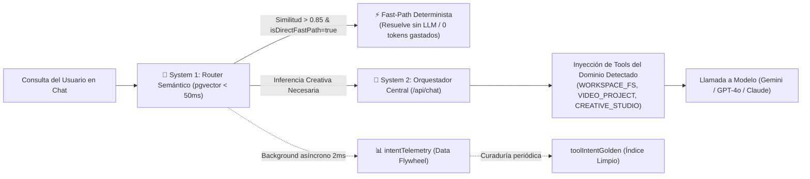
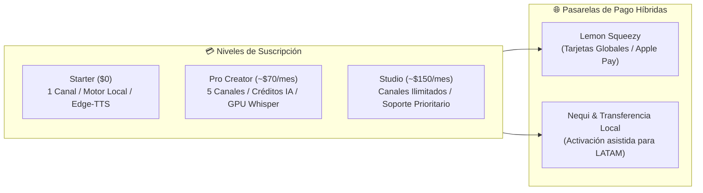
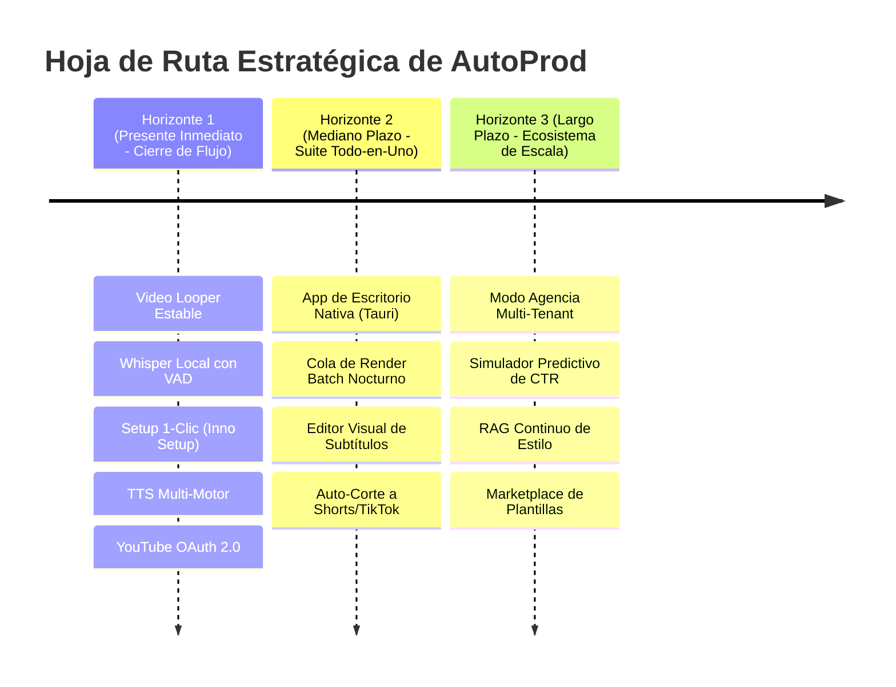

# 📄 Documento Ejecutivo & SRS (Software Requirements Specification)
# AutoProd — El Sistema Operativo para Canales de Contenido

> **Documento:** Especificación Formal de Requerimientos y Arquitectura de Sistema (SRS)  
> **Versión:** 3.0 (Arquitectura Agéntica Híbrida Descentralizada & Cognitive Operating System)  
> **Estado:** Aprobado / En Producción  
> **Clasificación:** Confidencial / Core System Architecture & Engineering Blueprint  
> **Target Audience:** Fundadores, Arquitectos de Software, Inversores Técnicos y Lead Engineers  

---

## 📑 Tabla de Contenidos

1. [Resumen Ejecutivo & Visión de Producto](#1-resumen-ejecutivo--visión-de-producto)
2. [El Manifiesto y los 4 Pilares de AutoProd](#2-el-manifiesto-y-los-4-pilares-de-autoprod)
3. [El Paradigma Económico: Cero Costos de Servidor ($0 Cloud Video Cost)](#3-el-paradigma-económico-cero-costos-de-servidor-0-cloud-video-cost)
4. [Arquitectura del Sistema: Topología Híbrida de Doble Capa](#4-arquitectura-del-sistema-topología-híbrida-de-doble-capa)
5. [Cerebro Cognitivo: System One (Router Semántico) & System Two (Orquestador Central)](#5-cerebro-cognitivo-system-one-router-semántico--system-two-orquestador-central)
6. [Taxonomía y Organización del Workspace Físico](#6-taxonomía-y-organización-del-workspace-físico)
7. [Mitigación de Puntos Críticos y Blindaje de Entorno Local](#7-mitigación-de-puntos-críticos-y-blindaje-de-entorno-local)
   - 7.1 Heterogeneidad de Hardware: Detección y Degradación Silenciosa (CUDA vs CPU)
   - 7.2 Red Local, Seguridad del Navegador y Protocolo PNA (Private Network Access)
   - 7.3 Estabilidad y Resiliencia en Procesos de Larga Duración (Render & Queues)
8. [Especificación Detallada de Módulos Funcionales (FEAT-01 a FEAT-20)](#8-especificación-detallada-de-módulos-funcionales-feat-01-a-feat-20)
   - 8.1 Video Studio & Timeline Pro con Looper Integrado
   - 8.2 Subtitulador Whisper con Silero VAD y Hardware Governor
   - 8.3 Text-to-Speech (TTS) Multi-Motor: Edge-TTS Ilimitado & OpenAI TTS
   - 8.4 Inteligencia de Canales, YouTube OAuth 2.0 y Anti-Repetición Semántica
   - 8.5 UI Conversacional Interactiva (Interactive Question Cards)
   - 8.6 Ciclo de Vida de VideoProjects y Separación de Caché
   - 8.7 Image Studio y Negociación de Créditos en Chat
   - 8.8 Instalador Autónomo 1-Clic (`AutoProd-Setup.exe`)
9. [Requerimientos No Funcionales (NFR) & Gobernanza de Seguridad](#9-requerimientos-no-funcionales-nfr--gobernanza-de-seguridad)
10. [Reglas Cardinales de Arquitectura del Repositorio](#10-reglas-cardinales-de-arquitectura-del-repositorio)
11. [Economía de Tokens, Modelo SaaS y Monetización Híbrida](#11-economía-de-tokens-modelo-saas-y-monetización-híbrida)
12. [Hoja de Ruta Evolutiva (Horizontes de Crecimiento)](#12-hoja-de-ruta-evolutiva-horizontes-de-crecimiento)

---

## 1. Resumen Ejecutivo & Visión de Producto

### 1.1 ¿Qué es AutoProd?
**AutoProd es el sistema operativo para canales de contenido.**  
No es un simple generador de videos asistido por IA, ni un script de automatización superficial, ni un clon de herramientas de edición en la nube. AutoProd es una **estación de trabajo integral (estilo IDE de desarrollo, pero diseñada para creadores y operadores de medios)** que unifica bajo una misma consola reactiva:
- La memoria histórica, identidad y directivas creativas de múltiples canales.
- La asistencia agéntica guiada para investigación de temas, guiones y diseño visual.
- Una mesa de montaje audiovisual multipista (Video Studio) con renderizado nativo.
- Un pipeline local de subtitulado fonético, síntesis de voz multi-motor y bucles de audio.
- Integración directa con plataformas de publicación (YouTube Data API v3).

### 1.2 Por Qué Falla el Software Actual
La producción contemporánea para plataformas como YouTube, TikTok y podcasts está fragmentada y quebrada:
1. **Dispersión Operativa:** Un creador utiliza de 5 a 8 aplicaciones desconectadas (ChatGPT para el guion, Midjourney para la miniatura, Premiere/CapCut para la edición, servicios web de subtítulos de pago por minuto, carpetas desordenadas en Windows y YouTube Studio para metadatos).
2. **El Problema de los Márgenes en la Nube:** Las plataformas SaaS de video tradicionales cobran cuotas prohibitivas ($50 a $200 USD/mes) porque intentan renderizar video en servidores remotos (AWS EC2 / GCP). Cada video de 1 hora o bucle de 3 horas destruye los márgenes brutos de la empresa proveedora, forzándolos a imponer límites draconianos de minutos y resoluciones comprimidas a 1080p.
3. **Pérdida de Soberanía:** El creador debe subir gigabytes de material original a servidores externos, quedando atado al ancho de banda de subida y perdiendo la custodia directa de sus archivos.

---

## 2. El Manifiesto y los 4 Pilares de AutoProd

> **Manifiesto de Marca:**  
> *«La automatización no reemplaza al creador. Le devuelve tiempo para crear.»*  
> *«Automatiza el trabajo. Conserva el control.»*

```
                    ┌────────────────────────┐
                    │      AUTOPROD OS       │
                    └───────────┬────────────┘
         ┌──────────────┬───────┴───────┬──────────────┐
         ▼              ▼               ▼              ▼
     [ CREA ]      [ PRODUCE ]     [ ANALIZA ]    [ ESCALA ]
    Ideación con    Mesa multipista, Referencias,   Multicanal,
    intención,      renders locales  métricas y     calendario y
    guiones y ADN   4K, TTS y        anti-repetición flujos de trabajo
    de canal.       subtítulos VAD.  semántica.     predecibles.
```

### Los 4 Pilares Fundacionales
1. **CREA (Convierte tus ideas en contenido con intención):** Investiga temas, estructura narrativas por bloques y redacta guiones alineados de forma inmutable con la voz, tono y nicho del canal mediante directivas persistentes.
2. **PRODUCE (Todo lo que necesitas para crear, en un solo lugar):** Ensambla bucles de video de 1 a 3 horas (Looper multitrack), monta clips con B-roll, sintetiza narraciones con voces neuronales y genera subtítulos palabra por palabra.
3. **ANALIZA (Entiende qué funciona y no repitas contenido):** Conecta canales de YouTube existentes vía OAuth 2.0 o extracción de metadatos, vectoriza el catálogo histórico publicado para evitar solapamientos temáticos y audita métricas de retención.
4. **ESCALA (Más capacidad, cero fricción mecánica):** Gestiona múltiples canales con total independencia de contexto, organiza la cola de producción y elimina los cuellos de botella de renderizado.

---

## 3. El Paradigma Económico: Cero Costos de Servidor ($0 Cloud Video Cost)

El diferencial macro de AutoProd se sintetiza en: **«Tu contenido. Tu equipo. Tu control»**.

```mermaid
flowchart TD
    subgraph SaaS_Tradicional["❌ Paradigma Tradicional (Margen Negativo)"]
        User1["Usuario"] -->|Upload 5GB metraje bruto| CloudServer["Cluster de Servidores Cloud (AWS/GCP)"]
        CloudServer -->|Consumo masivo CPU/GPU en nube| GPUCost["Costo exorbitante de computación ($$$)"]
        GPUCost -->|Límite artificial de minutos| CompressedVideo["Render Comprimido 1080p"]
    end

    subgraph AutoProd_Hybrid["✅ Paradigma AutoProd ($0 Server Cost)"]
        User2["Usuario"] -->|Lectura local 0 ms (NVMe/SSD)| LocalEngine["Motor Local Python (localhost:8000)"]
        LocalEngine -->|GPU Local (CUDA) o CPU Multihilo| LocalRender["Render Nativo 4K Ilimitado"]
        LocalEngine -->|Hardware del cliente ($0 para AutoProd)| FreeMargin["Margen Bruto de SaaS > 85%"]
        CloudControl["Next.js + Supabase Cloud"] -.->|Orquestación Ligera (Tokens / Auth)| LocalEngine
    end
```

### Ventajas Competitivas Clave:
- **Margen Bruto SaaS Superior al 85%:** AutoProd no asume facturas de cómputo gráfico ni almacenamiento en caliente para videos. El servidor cloud solo transmite texto (prompts, metadatos, tokens de autenticación).
- **Resolución 4K sin Restricciones:** El límite de resolución, tasa de bits y duración lo define el hardware del usuario, no un plan de precios arbitrario.
- **Acceso a Disco a Velocidad de Bus (0 ms I/O):** No hay tiempo de espera de subida ni descarga. El motor opera sobre archivos en rutas locales.

---

## 4. Arquitectura del Sistema: Topología Híbrida de Doble Capa

AutoProd separa estrictamente el **Plano de Control (Control Plane)** en la nube del **Plano de Datos y Ejecución (Data Plane)** en la máquina local:

```mermaid
flowchart TB
    subgraph ClientMachine["💻 Máquina Local del Usuario (Data Plane)"]
        UI["🖥️ Next.js Web IDE (Puerto 3000)\nReact 19 / Tailwind v4 / UI Panels"]
        LocalMotor["⚙️ Motor Local Python (Puerto 8000)\nFastAPI + Uvicorn (autoprod-motor.exe)"]
        HW_Gov["🛡️ Hardware Governor\nMonitoreo de CPU/GPU, VRAM, Semáforos"]
        LocalFS["📁 Filesystem Local\nWorkspace / Canales / InfoCanal / Videos"]
        FFmpegBin["🎞️ FFmpeg + CTranslate2 (Faster-Whisper) + Silero VAD + Edge-TTS"]
    end

    subgraph CloudInfra["☁️ AutoProd Cloud (Control Plane)"]
        NextServer["🌐 Next.js Backend (App Router)\nAPI Routes / Server Actions"]
        SemanticRouter["🧠 System 1: Router Semántico\nVector Cosine Matcher (< 50ms)"]
        Orchestrator["🤖 System 2: Orquestador Central (/api/chat)\nFunction Calling Tool Loop"]
        DB["🗄️ Supabase PostgreSQL\nMulti-schema: public, auth, vault, pgvector"]
        LemonSqueezy["💳 Facturación & Webhooks\nLemon Squeezy + Conciliación Nequi"]
        ExternalLLM["⚡ Modelos de Lenguaje\nGoogle Gemini, OpenAI GPT-4o, Anthropic Claude"]
    end

    UI <-->|HTTP / WebSockets (CORS seguro)| LocalMotor
    LocalMotor <--> HW_Gov
    LocalMotor <--> LocalFS
    LocalMotor <--> FFmpegBin
    UI <-->|HTTPS / Cookies SSR Fast-Path| NextServer
    NextServer <--> SemanticRouter
    NextServer <--> Orchestrator
    NextServer <--> DB
    Orchestrator <--> ExternalLLM
    LemonSqueezy --> NextServer
```

---

## 5. Cerebro Cognitivo: System One (Router Semántico) & System Two (Orquestador Central)

AutoProd no es un simple wrapper de LLM con prompts largos. Implementa una arquitectura cognitiva inspirada en la teoría de toma de decisiones de doble proceso:



### 5.1 System 1: Router Semántico Jerárquico (`FEAT-19`)
- **Objetivo:** Tomar decisiones en < 50ms antes de llamar al LLM, reduciendo costos de tokens, alucinaciones y latencia.
- **Índice Vectorial (`toolIntentGolden`):** Almacén de intenciones canónicas vectorizadas con `vector(1536)` sobre `pgvector` con índices HNSW.
- **Fast-Path Determinista:** Consultas de estado (ej: *"qué videos tengo en este canal"*, *"cuántos créditos me quedan"*) se resuelven de inmediato sin tocar un modelo de lenguaje.
- **Domain Tool Retrieval:** Inyecta en el prompt únicamente las herramientas relevantes para el dominio activo (`WORKSPACE_FS`, `VIDEO_PROJECT`, `CHANNEL_MEMORY`, `CREATIVE_STUDIO`, `SYSTEM`), evitando que el modelo se confunda con un catálogo masivo de herramientas.
- **Data Flywheel (`intentTelemetry`):** Cada consulta real se registra asíncronamente a costo $0 para nutrir el modelo mediante arneses de curaduría (`harness/maintenance/curate_intents.ts`).

### 5.2 System 2: Orquestador Central (`app/api/chat/route.ts`)
- **Monocerebro Único:** Toda interacción agéntica ocurre en un solo punto neurálgico. Prohibido crear sub-agentes paralelos o endpoints dispersos.
- **Tool Loop Agéntico Multi-Paso:** Soporta hasta 5 iteraciones automáticas de llamada a herramientas (*Function Calling*).
- **Intercepción de Herramientas Locales (`LOCAL:*`):** Las llamadas a herramientas del sistema de archivos local se interceptan en el servidor para delegarlas al motor de Python (`localhost:8000`), inyectando el resultado de vuelta en el contexto del modelo.
- **Cero Hardcoding de Prompts:** Todo procedimiento operativo estándar (SOP) vive en la tabla `PromptTemplate` de la base de datos y se carga dinámicamente mediante la tool `consultar_prompts`.

---

## 6. Taxonomía y Organización del Workspace Físico

El sistema de archivos de AutoProd se estructura de forma determinista en 3 niveles jerárquicos:

```
📁 {workspace_root}/                            <-- [NIVEL 0: Raíz del Workspace en Disco]
└── 📁 NombreDelCanal/                          <-- [NIVEL 1: CANAL] (Universo temático soberano)
    ├── 📁 InfoCanal/                            <-- [NIVEL 2: MEMORIA Y ADN DEL CANAL] (¡NO es un video!)
    │   ├── Contexto_canal.md                   (Nicho, audiencia objetivo, tono de voz y directivas)
    │   ├── Metricas_canal.md                   (Estadísticas, palabras clave y pilares de contenido)
    │   ├── Historial_canal.md                  (Registro estructurado de contenidos publicados)
    │   └── Branding_canal.md                   (Especificaciones de logo, banner y marca de agua)
    │
    └── 📁 Titulo_Del_Proyecto_Video/            <-- [NIVEL 2: PROYECTO DE VIDEO] (Hermano de InfoCanal)
        ├── config_video.md                     (Ficha de producción: SEO, título, tags, descripción)
        ├── 📁 Guiones/                         <-- [NIVEL 3: Recursos Modulares de Producción]
        │   └── guion_final.md
        ├── 📁 Videos/                          (Metraje en bruto, clips B-roll y render final .mp4)
        ├── 📁 Miniatura/                       (Prompts, variantes DALL-E y portada aprobada)
        ├── 📁 Musica/                          (Pistas de audio y fondos sonoros en bucle)
        └── 📁 Ambiente/                        (Efectos SFX y texturas atmosféricas)
```

### Reglas Rectoras del Workspace:
- **`InfoCanal/` es un Ancla Cognitiva:** Es la memoria viva del canal. El orquestador la consulta obligatoriamente antes de proponer cualquier idea, garantizando consistencia editorial. **NUNCA se procesa como un video.**
- **Modularidad Adaptativa:** La estructura de 5 carpetas en Nivel 3 (`Guiones`, `Videos`, `Miniatura`, `Musica`, `Ambiente`) es la plantilla base recomendada, pero el sistema no impone bloqueos artificiales si un formato de contenido no requiere alguna de ellas.

---

## 7. Mitigación de Puntos Críticos y Blindaje de Entorno Local

Esta sección resuelve de manera exhaustiva las inquietudes operativas inherentes a la ejecución en máquinas heterogéneas de clientes:

### 7.1 Heterogeneidad de Hardware: Detección y Degradación Silenciosa (CUDA vs CPU)
**Problema:** Los usuarios tienen equipos muy diversos: desde laptops con gráficos integrados Intel/AMD hasta estaciones de trabajo con NVIDIA RTX. Intentar forzar CUDA en máquinas no compatibles causaría cierres forzados.  
**Solución Implementada en AutoProd (`controlador/hardware.py` & `subtitles.py`):**
1. **Detección Dinámica de Hardware en Arranque:**
   - Consulta `nvidia-smi` y el registro de Windows (`HKLM\SYSTEM\CurrentControlSet\Control\Class\...`) para identificar GPU dedicada y soporte CUDA (`has_cuda: true/false`).
   - Mide el número de núcleos lógicos y memoria RAM física.
2. **Degradación Automática de Whisper (Subtítulos):**
   - Si `has_cuda == true`: Carga Faster-Whisper en GPU con precisión `float16`.
   - Si `has_cuda == false`: Degrada silenciosamente a CPU con cuantización `int8`, reduciendo el uso de memoria a una fracción sin perder precisión fonética.
3. **Degradación Automática de Video (FFmpeg):**
   - Con GPU NVIDIA: Utiliza el codificador de hardware `h264_nvenc`.
   - Sin GPU NVIDIA: Utiliza `libx264` con preset multihilo optimizado (`preset=fast` o `veryfast`).
4. **Cálculo de Hilos Seguros (`safe_threads`):**
   - El sistema calcula `safe_threads = max(1, cpu_cores - 2)` para evitar que la codificación sature el 100% de la CPU y congele la interfaz del sistema operativo.

### 7.2 Red Local, Seguridad del Navegador y Protocolo PNA (Private Network Access)
**Problema:** Los navegadores modernos bloquean peticiones HTTP desde un origen HTTPS público hacia `http://localhost:8000` bajo las directivas de Private Network Access (PNA) y CORS mixto.  
**Solución Técnica en AutoProd:**
1. **Fase Actual (Consola / Localhost):** La consola de desarrollo y producción se sirve en red local o mediante túnel local seguro, configurando encabezados explícitos:
   - `Access-Control-Allow-Private-Network: true`
   - `Access-Control-Allow-Origin: *` (restringido en runtime al origen de la app).
2. **Horizonte 2 (Arquitectura Tauri Definitiva):**
   - La aplicación se compilará en un binario nativo de escritorio mediante **Tauri** (Rust + WebView2).
   - En Tauri, la comunicación entre la UI y el motor local se realiza mediante llamadas nativas IPC (*Inter-Process Communication*) y sockets Unix/Named Pipes en memoria, eliminando completamente la pila HTTP del navegador y cualquier restricción de CORS o PNA.

### 7.3 Estabilidad y Resiliencia en Procesos de Larga Duración (Render & Queues)
**Problema:** Un render de video de 3 horas o una transcripción extensa pueden fallar si el usuario suspende el equipo o cierra la ventana.  
**Solución Implementada en AutoProd:**
1. **Hardware Governor & Semáforos de Tareas:**
   - La clase `HardwareGovernor` implementa colas de tareas con semáforos de concurrencia: solo se permite un renderizado intensivo simultáneo.
2. **Desacople Asíncrono de Procesos:**
   - FFmpeg y Whisper no bloquean los hilos de FastAPI. Se ejecutan en subprocesos independientes del sistema operativo con redirección de logs (`stdout/stderr`) a archivos de progreso temporal.
3. **Persistencia de Estado en VideoProjects:**
   - El estado de la línea de tiempo se sincroniza en PostgreSQL (`videoProject.status`: `DRAFT`, `RENDERING`, `RENDERED`) con debounce automático de 2 segundos. Si el navegador se cierra, el proyecto permanece intacto en base de datos.
4. **Separación de Archivos Temporales (`isCache: true`):**
   - Los archivos de render intermedio y previsualización se marcan como temporales en la tabla `Asset`, permitiendo al usuario purgarlos con un clic (`/api/assets/clear-cache`) sin comprometer sus recursos permanentes.

---

## 8. Especificación Detallada de Módulos Funcionales (FEAT-01 a FEAT-20)

### 8.1 Video Studio & Timeline Pro con Looper Integrado (`FEAT-04`)
- **Editor Multipista:** Pistas independientes para video base, pista musical, efectos de sonido y subtítulos.
- **Motor Looper de Audio:** Algoritmo que calcula la duración deseada (ej. 1 hora, 2 horas, 3 horas) y genera un fundido cruzado (*crossfade*) imperceptible entre ciclos musicales.
- **Previsualizador Rápido de 5 Minutos:** Genera un render acelerado de baja resolución para validar el ritmo audiovisual antes del renderizado final 4K.

### 8.2 Subtitulador Whisper con Silero VAD y Hardware Governor (`FEAT-05`)
- **Voice Activity Detection (Silero VAD):** Filtra silencios, ruidos de fondo y respiraciones antes de enviar los fragmentos a transcribir, acelerando el proceso un 40%.
- **Marcas de Tiempo Palabra por Palabra:** Sincronización milimétrica para generación de subtítulos dinámicos estilo reels/shorts.
- **Exportación Flexible:** Genera archivos `.srt`, `.vtt` y formato compatible para importación en CapCut y Adobe Premiere.

### 8.3 Text-to-Speech (TTS) Multi-Motor (`FEAT-15`)
- **Motor Local Gratuito (Edge-TTS):** Acceso a docenas de voces neuronales en español e inglés sin costo alguno ($0 de API), ideal para el plan gratuito.
- **Motor de Alta Definición (OpenAI TTS):** Voces de máxima expresividad (`alloy`, `echo`, `fable`, `onyx`, `nova`, `shimmer`) con deducción transparente de créditos.

### 8.4 Inteligencia de Canales, YouTube OAuth 2.0 y Anti-Repetición Semántica (`FEAT-06` & `FEAT-18`)
- **Extractor de Canales:** Analiza canales líderes del nicho para identificar estructuras ganadoras y almacenarlas en `channelContext`.
- **Conexión YouTube OAuth 2.0:** Vinculación oficial del canal del usuario para leer estadísticas reales y sincronizar el historial publicado.
- **Anti-Repetición Vectorial:** Antes de crear un nuevo video, el sistema calcula la similitud de coseno contra `ContentHistory` para alertar al creador si la idea propuesta es demasiado parecida a un contenido anterior.

### 8.5 UI Conversacional Interactiva: Interactive Question Cards (`FEAT-16`)
- **Eliminación del Texto Plano:** El agente no responde con párrafos interminables.
- **Tarjetas Visuales Reactivas:** Envía bloques ````interactive-question```` que el frontend renderiza como botones cliqueables con etiquetas de costo (`⚡ 0 créditos`, `🧠 ~2 créditos`, `🚀 ~5 créditos`).
- **Control Humano en el Bucle:** El creador toma decisiones clave con un solo clic.

### 8.6 Ciclo de Vida de VideoProjects y Gestión de Proyectos (`FEAT-18`)
- **Desacoplamiento Canales-Videos:** Un proyecto de video puede existir de forma independiente sin pertenecer a un canal formal.
- **Auto-Guardado con Debounce:** Modificaciones en la mesa de edición se guardan automáticamente cada 2 segundos.
- **Filtro de Caché Inteligente:** Permite liberar gigabytes de almacenamiento temporal sin riesgo de borrar metraje original.

### 8.7 Image Studio y Negociación de Créditos en Chat (`FEAT-08` & `FEAT-20`)
- **Generación Visual en Chat:** Tool `generar_imagen` invocable directamente desde la conversación para crear portadas o bocetos.
- **Negociación Previa:** El agente consulta al usuario y muestra la confirmación de créditos antes de disparar la llamada a DALL-E 3.

### 8.8 Instalador Autónomo 1-Clic (`FEAT-17`)
- **Paquete Standalone (`AutoProd-Setup.exe` / `.dmg`):** Asistente gráfico creado con Inno Setup y PyInstaller.
- **Cero Terminal:** Incluye automáticamente el runtime de Python, binarios de FFmpeg, yt-dlp y dependencias de sistema. El usuario no requiere instalar Git, Node ni Python manualmente.

---

## 9. Requerimientos No Funcionales (NFR) & Gobernanza de Seguridad

| Dimensión | Requerimiento Técnico | Implementación en AutoProd |
|---|---|---|
| **Seguridad de Claves (BYOK)** | Cifrado de claves de API externas en reposo y en tránsito. | Almacenadas en **Supabase Vault** con cifrado AES-GCM; desencriptadas exclusivamente en memoria del servidor mediante funciones RPC. |
| **Privacidad de Usuarios** | Protección y cumplimiento anti-abuso de direcciones IP. | Las IPs se anonimizan inmediatamente usando **HMAC SHA-256** con sal secreta. Nunca se almacenan IPs en texto plano. |
| **Seguridad del SO Local** | Prevención de vulnerabilidades de cruce de carpetas (*Path Traversal*). | Validación estricta con `os.path.realpath` en el motor de Python para impedir accesos fuera del workspace permitido. |
| **Latencia de Autenticación** | Validación de sesión sin degradación de velocidad. | **Fast-Path SSR (0 ms):** Verificación síncrona local del JWT de Supabase en microsegundos, con fallback asíncrono solo si expira. |
| **Idempotencia de Esquema** | Despliegue de infraestructura predecible y reproducible. | Migraciones SQL secuenciales numeradas (`005_...`, `006_...`) 100% idempotentes (`CREATE TABLE IF NOT EXISTS`, `ON CONFLICT DO NOTHING`). |

---

## 10. Reglas Cardinales de Arquitectura del Repositorio

Todo cambio al código fuente de AutoProd debe adherirse estrictamente a las **7 Reglas Cardinales**:

1. **Un Solo Cerebro Orquestador (`app/api/chat/route.ts`):** Prohibido crear sub-agentes dispersos o rutas paralelas de chat.
2. **Herramientas Centralizadas en `app/api/tools/`:** Cualquier acción ejecutable reside obligatoriamente en `app/api/tools/[nombre_tool]/route.ts`.
3. **Cero Hardcoding de Prompts:** Las directivas de sistema y SOPs viven en la tabla `PromptTemplate` de la base de datos y se cargan bajo demanda vía `consultar_prompts`.
4. **Infraestructura vía Migraciones SQL:** Esquemas y datos base se definen en `migrations/*.sql` con prefijo secuencial de 3 dígitos (`005_...`). Prohibido usar seeds manuales en runtime.
5. **Tono de Voz Sobrio (Cero Humo, Cero Tecnicismos en UI):** En textos visibles al usuario está terminantemente prohibido exponer tecnologías internas (FastAPI, FFmpeg, Whisper, CUDA, pgvector) o clichés de marketing agresivo ("viral", "fórmulas mágicas").
6. **Soberanía y Exclusividad de Ejecución de Arneses (`harness/`):** La IA puede crear y mantener scripts en `harness/`, pero **su ejecución queda reservada exclusivamente al usuario humano** desde su terminal.
7. **Estricta Prohibición de Agregados Fantasma en UI:** Prohibido crear botones, toggles, badges o componentes visuales no pedidos explícitamente por el usuario.

---

## 11. Economía de Tokens, Modelo SaaS y Monetización Híbrida

AutoProd opera bajo un esquema de suscripción recurrente con add-ons de créditos:



- **Consumo Transparente de Créditos:** El usuario visualiza en tiempo real su saldo mediante el componente `TokenTracker`, auditando exactamente el costo de cada operación de IA.
- **BYOK (Bring Your Own Key):** Los usuarios avanzados pueden ingresar sus propias API keys de Gemini, OpenAI o Anthropic, reduciendo a cero el costo de tokens para la plataforma.

---

## 12. Hoja de Ruta Evolutiva (Horizontes de Crecimiento)



### 12.1 Horizonte 1: El Flujo de Producción Cerrado (Completado / En Operación)
- Arquitectura híbrida Next.js + FastAPI en `localhost:8000`.
- Instalador unificado 1-clic (`AutoProd-Setup.exe`).
- Síntesis de voz multi-motor con Edge-TTS ilimitado a costo cero.
- Sincronización oficial de canales con YouTube OAuth 2.0.
- Router Semántico (System 1) y orquestador agéntico con Interactive Question Cards.

### 12.2 Horizonte 2: La Suite Todo-en-Uno (Próximos Sprints)
- **Empaquetado Nativo con Tauri:** Migración de la UI web a una aplicación de escritorio nativa multiplataforma con comunicación IPC interna, eliminando completamente las barreras de red local y CORS/PNA.
- **Cola de Producción Nocturna (Batch Queue):** Capacidad de programar 20+ videos para renderizar secuencialmente de noche aprovechando la GPU desocupada.
- **Auto-Corte Inteligente a Formato Vertical (9:16):** Detección de momentos de alta energía y ritmo vocal para generar Shorts y TikToks con subtítulos animados de forma desatendida.
- Expansión de voces ultra-realistas mediante conectores a ElevenLabs y Cartesia.

### 12.3 Horizonte 3: Plataforma de Escala y Agencias (Visión a Largo Plazo)
- **Modo Agencia (Multi-Tenant):** Gestión colaborativa de decenas de canales con permisos diferenciados por rol (Guionista, Editor, Manager, Cliente).
- **Simulador A/B Predictivo:** Modelos de visión que evalúan el contraste, composición y psicología visual de miniaturas antes de publicar, prediciendo la probabilidad de clics (CTR).
- **Marketplace Comunitario:** Ecosistema donde creadores pueden publicar y monetizar sus propias plantillas de guiones, presets de timeline y flujos agénticos.

---

> **Conclusión de Arquitectura:**  
> AutoProd consolida una categoría nueva de software para creadores: el **Sistema Operativo Descentralizado para Medios**. Al combinar la agilidad cognitiva de la nube con la soberanía, velocidad y costo cero del hardware local, elimina los cuellos de botella de margen y escalabilidad que limitan a las herramientas convencionales.
