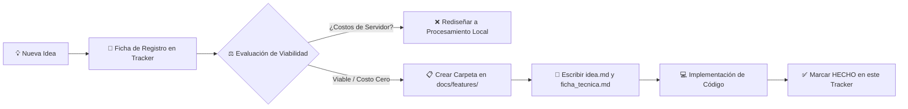

# 🎯 Matriz Maestra de Funcionalidades, Alcance & Ideas de Escalabilidad
## AutoProd Production IDE — Master Feature Tracker & Product Backlog

> **Ubicación:** `docs/features/README.md`  
> **Versión del Tracker:** 2.0.0  
> **Arquitectura:** Híbrida Descentralizada (Next.js Cloud + FastAPI Motor Local `localhost:8000` + Supabase/Prisma)  
> **Filosofía de Escalabilidad:** $0 Server Cost — Procesamiento pesado local (GPU/CPU del cliente), BYOK + cuota gratuita optimizada en IA.

---

## 🏛️ Contexto Macro de AutoProd

Antes de explorar los módulos específicos, consulta la visión y arquitectura global del sistema:
- ⚙️ **[Ficha Técnica General de AutoProd](file:///e:/autoprod/docs/features/AutoProd/ficha_tecnica.md):** Arquitectura completa, stack tecnológico, puertos y modelos de datos.
- 💡 **[Visión Estratégica de AutoProd (Lo que Tenemos vs. Hacia Dónde Vamos)](file:///e:/autoprod/docs/features/AutoProd/idea.md):** El norte de negocio, los 3 horizontes de crecimiento y el salto de herramienta a SaaS.

---

## 📌 1. Convenciones y Estados de Seguimiento

| Estado | Icono | Definición |
|---|:---:|---|
| **Hecho** | `✅ HECHO` | Implementado, funcional, integrado con frontend/backend y con `ficha_tecnica.md`. |
| **En Progreso** | `🔄 EN PROGRESO` | En desarrollo activo o refactorización técnica en curso. |
| **Planificado** | `📋 PLANIFICADO` | Alcance y arquitectura definidos; listo para sprint inmediato. |
| **Idea / Backlog** | `💡 IDEA` | Concepto propuesto en evaluación de viabilidad y ROI técnico. |
| **En Pausa / Descartado** | `⏸️ EN PAUSA` | Pospuesto temporalmente o descartado por costos/complejidad. |

- **Prioridades:** `P0` (Crítica / Bloqueante de negocio), `P1` (Alto valor), `P2` (Medio), `P3` (Largo plazo).
- **Esfuerzo:** `S` (horas), `M` (1-2 días), `L` (3-5 días), `XL` (> 1 semana).

---

## 🚀 2. Módulos Operativos (`✅ HECHO`)

Cada funcionalidad cuenta con su **Ficha Técnica** (código, endpoints y arquitectura) y su documento de **Idea** (alcance hecho vs. faltante y escalabilidad):

| ID | Módulo / Funcionalidad | Capa Principal | Documentación Técnica & de Negocio |
|---|---|---|---|
| **FEAT-01** | **Orquestador Agéntico & Chat Universal** | Next.js / AI SDK / Prisma | [Ficha Técnica](file:///e:/autoprod/docs/features/agentic_orchestrator/ficha_tecnica.md) \| [Idea & Escalabilidad](file:///e:/autoprod/docs/features/agentic_orchestrator/idea.md) |
| **FEAT-02** | **Motor Local de Operaciones del SO** | FastAPI (8000) / Uvicorn | [Ficha Técnica](file:///e:/autoprod/docs/features/local_motor/ficha_tecnica.md) \| [Idea & Escalabilidad](file:///e:/autoprod/docs/features/local_motor/idea.md) |
| **FEAT-03** | **Gestor de Workspace & Carpetas (Folder CRUD)** | FastAPI / React / Prisma | [Ficha Técnica](file:///e:/autoprod/docs/features/folder_crud/ficha_tecnica.md) \| [Idea & Escalabilidad](file:///e:/autoprod/docs/features/folder_crud/idea.md) |
| **FEAT-04** | **Video Studio & Timeline Pro (con Looper Express Integrado)** | FastAPI / FFmpeg / Moviepy | [Ficha Técnica](file:///e:/autoprod/docs/features/video_looper/ficha_tecnica.md) \| [Idea & Escalabilidad](file:///e:/autoprod/docs/features/video_looper/idea.md) |
| **FEAT-05** | **Subtitulador Whisper & Hardware Governor** | Python / Whisper / Silero VAD | [Ficha Técnica](file:///e:/autoprod/docs/features/subtitles_whisper/ficha_tecnica.md) \| [Idea & Escalabilidad](file:///e:/autoprod/docs/features/subtitles_whisper/idea.md) |
| **FEAT-06** | **Extractor de Canales YouTube & pgvector** | Next.js / YouTube API / pgvector | [Ficha Técnica](file:///e:/autoprod/docs/features/youtube_channel_extractor/ficha_tecnica.md) \| [Idea & Escalabilidad](file:///e:/autoprod/docs/features/youtube_channel_extractor/idea.md) |
| **FEAT-07** | **Biblioteca Unificada de Recursos (Asset Library)** | Next.js / Supabase / FS Local | [Ficha Técnica](file:///e:/autoprod/docs/features/asset_library/ficha_tecnica.md) \| [Idea & Escalabilidad](file:///e:/autoprod/docs/features/asset_library/idea.md) |
| **FEAT-08** | **Image & Thumbnail Studio** | DALL-E 3 / OpenAI Vision | [Ficha Técnica](file:///e:/autoprod/docs/features/image_generator/ficha_tecnica.md) \| [Idea & Escalabilidad](file:///e:/autoprod/docs/features/image_generator/idea.md) |
| **FEAT-09** | **Sistema de Suscripciones & Monetización** | Next.js / Lemon Squeezy / Nequi | [Ficha Técnica](file:///e:/autoprod/docs/features/subscriptions_and_billing/ficha_tecnica.md) \| [Idea & Escalabilidad](file:///e:/autoprod/docs/features/subscriptions_and_billing/idea.md) |
| **FEAT-10** | **Token Tracker & Auditoría de Consumo** | Next.js / Prisma / Supabase | [Ficha Técnica](file:///e:/autoprod/docs/features/token_tracker/ficha_tecnica.md) \| [Idea & Escalabilidad](file:///e:/autoprod/docs/features/token_tracker/idea.md) |
| **FEAT-11** | **Auth Guard SSR & Supabase Vault** | Next.js SSR / Vault RPC | [Ficha Técnica](file:///e:/autoprod/docs/features/auth_guard/ficha_tecnica.md) \| [Idea & Escalabilidad](file:///e:/autoprod/docs/features/auth_guard/idea.md) |
| **FEAT-12** | **Gobernanza de Canales (localPath, niche, Guardrail IA)** | Next.js / Prisma / AI SDK | [Ficha Técnica](file:///e:/autoprod/docs/features/channel_governance/ficha_tecnica.md) \| [Idea & Escalabilidad](file:///e:/autoprod/docs/features/channel_governance/idea.md) |
| **FEAT-13** | **Rediseño Integral de Frontend (Landing & Consola)** | Next.js / React 19 / Tailwind | [Ficha Técnica](file:///e:/autoprod/docs/features/landing_and_console_revamp/ficha_tecnica.md) \| [Idea & Escalabilidad](file:///e:/autoprod/docs/features/landing_and_console_revamp/idea.md) |
| **FEAT-14** | **Sistema Anti-Abuso, Rate Limiting & HMAC IP Hashing** | Next.js / Crypto / RAM Cache | [Ficha Técnica](file:///e:/autoprod/docs/features/anti_abuse_and_rate_limit/ficha_tecnica.md) \| [Idea & Escalabilidad](file:///e:/autoprod/docs/features/anti_abuse_and_rate_limit/idea.md) |
| **FEAT-15** | **Text-to-Speech Multi-Motor (Edge-TTS & OpenAI)** | FastAPI / Edge-TTS / OpenAI | [Ficha Técnica](file:///e:/autoprod/docs/features/text_to_speech/ficha_tecnica.md) \| [Idea & Escalabilidad](file:///e:/autoprod/docs/features/text_to_speech/idea.md) |
| **FEAT-16** | **Orquestación de Canales, Capa de Video (`config_video.md`) & Interactive Question Cards** | Next.js / React 19 / Prisma | [Ficha Técnica](file:///e:/autoprod/docs/features/channel_and_video_orchestration/ficha_tecnica.md) \| [Idea & Escalabilidad](file:///e:/autoprod/docs/features/channel_and_video_orchestration/idea.md) |
| **FEAT-17** | **Instalador Oficial Standalone (`AutoProd-Setup.exe` / `.dmg`)** | Inno Setup / PyInstaller / GitHub Releases | [Ficha Técnica](file:///e:/autoprod/docs/features/standalone_installer/ficha_tecnica.md) \| [Idea & Escalabilidad](file:///e:/autoprod/docs/features/standalone_installer/idea.md) |

---

## 🔄 3. Funcionalidades en Curso y Próximos Sprints (`🔄 EN PROGRESO` / `📋 PLANIFICADO`)

| ID | Funcionalidad | Prioridad | Esfuerzo | Estado | Descripción & Dependencias |
|---|---|:---:|:---:|:---:|---|
| **PIPE-01** | **Instalador Automático 1-Clic (`AutoProd-Setup.exe` / `.dmg`)** | `P1` | `L` | `✅ HECHO` | Compilación Inno Setup / DMG, distribución de `autoprod-motor.exe` con binarios (`ffmpeg`, `yt-dlp`) y entrega vía `/api/setup/download-installer`. |
| **PIPE-02** | **Wizards Modales de Creación Rápida** | `P2` | `M` | `📋 PLANIFICADO` | Flujos paso a paso para nuevo canal, nuevo video y nuevo guion antes de iniciar el chat libre, inyectando respuestas al prompt maestro del sistema. |
| **PIPE-03** | **Calendario de Publicación & Cron Automatizado** | `P2` | `L` | `📋 PLANIFICADO` | Vista de calendario mensual (`/dashboard/calendar`) con drag & drop para programar videos a fechas/horas específicas y disparo desatendido con cron. |


---

## 💡 4. Banco de Ideas de Escalabilidad (Product Backlog)

### 🎬 A. Producción Multimedia & Edición Avanzada
| ID | Idea | Prioridad | Esfuerzo | Estado | Hipótesis / Valor de Negocio |
|---|---|:---:|:---:|:---:|---|
| **IDEA-A1** | **B-Roll Auto-Finder & AI Video Studio** | `P1` | `L` | `💡 IDEA` | Agente que analiza el guion y descarga clips libres de derechos (Pexels, Pixabay) o genera video sintético IA. [Ver Ficha](file:///e:/autoprod/docs/features/ai_video_and_broll/ficha_tecnica.md) \| [Ver Idea](file:///e:/autoprod/docs/features/ai_video_and_broll/idea.md) |
| **IDEA-A2** | **Expansión TTS Hiperrealista (ElevenLabs & Cartesia)** | `P1` | `M` | `💡 IDEA` | Expansión del motor TTS existente (FEAT-15): agregar ElevenLabs y Cartesia Sonic como motores adicionales de ultra fidelidad. |
| **IDEA-A3** | **Render Batch en Cola de Producción** | `P1` | `L` | `💡 IDEA` | Capacidad de poner múltiples videos en cola para renderizar consecutivamente de noche aprovechando la GPU desocupada. |
| **IDEA-A4** | **Auto-Corte de Videos a YouTube Shorts / TikTok** | `P2` | `XL` | `💡 IDEA` | Detección de momentos con mayor energía en videos largos para re-encuadrar a formato vertical (9:16) con subtítulos cinemáticos. |
| **IDEA-A5** | **Generador de Música IA & Soundscapes (AI Music Studio)** | `P1` | `L` | `💡 IDEA` | Generación de pistas musicales de fondo y soundscapes sin copyright (MusicGen local / BYOK) con bucles perfectos. [Ver Ficha](file:///e:/autoprod/docs/features/music_generator/ficha_tecnica.md) \| [Ver Idea](file:///e:/autoprod/docs/features/music_generator/idea.md) |

### 🤖 B. Inteligencia Artificial Agéntica & Optimización SEO
| ID | Idea | Prioridad | Esfuerzo | Estado | Hipótesis / Valor de Negocio |
|---|---|:---:|:---:|:---:|---|
| **IDEA-B1** | **A/B Testing Simulator de Miniaturas y Títulos** | `P1` | `M` | `💡 IDEA` | Agente con visión que evalúa contraste y psicología de color de miniaturas y predice probabilidad de CTR. |
| **IDEA-B2** | **Analista Predictivo de Retención de Guiones** | `P2` | `M` | `💡 IDEA` | Escaneo del guion para detectar caídas de ritmo, exceso de palabras muertas o ganchos lentos antes de renderizar. |
| **IDEA-B3** | **Copilot de Tendencias y Scraping de Competencia** | `P2` | `L` | `💡 IDEA` | Monitoreo recurrente de canales líderes para alertar sobre temas que están explotando en visitas en las últimas 48 horas. |
| **IDEA-B4** | **RAG Dinámico de Estilo de Canal** | `P1` | `M` | `💡 IDEA` | Inyección de la personalidad única del canal aprendiendo del histórico de guiones ya publicados. |

### 📊 C. Integración de Plataforma & Métricas
| ID | Idea | Prioridad | Esfuerzo | Estado | Hipótesis / Valor de Negocio |
|---|---|:---:|:---:|:---:|---|
| **IDEA-C1** | **Dashboard de Analíticas y Retención de YouTube** | `P1` | `M` | `💡 IDEA` | Conexión con YouTube Analytics API para mostrar gráficas de retención, visitas por hora y CTR en el dashboard. |
| **IDEA-C2** | **Generador de Community Posts & Stories** | `P2` | `S` | `💡 IDEA` | Automatización de publicaciones para la pestaña Comunidad previas al estreno para calentar audiencia. |
| **IDEA-C3** | **Notificaciones Webhook a Discord / Telegram** | `P2` | `S` | `💡 IDEA` | Envío de alertas cuando un render nocturno termina o cuando un video se publica exitosamente. |
| **IDEA-C4** | **Conexión de Canal vía YouTube OAuth 2.0** | `P2` | `XL` | `💡 IDEA` | Integración y autenticación con OAuth 2.0 para acceso directo al canal (tokens de refresco, permisos/scopes y cuotas de Google Cloud). |

### 💼 D. Negocio, SaaS, Cuentas & Multi-Tenant
| ID | Idea | Prioridad | Esfuerzo | Estado | Hipótesis / Valor de Negocio |
|---|---|:---:|:---:|:---:|---|
| **IDEA-D1** | **Modo Agencia: Workspaces Multi-Canal y Equipos** | `P1` | `XL` | `💡 IDEA` | Roles de equipo (Guionista, Editor, Manager, Dueño) colaborando en el mismo espacio con permisos diferenciados. |
| **IDEA-D2** | **Portal de Facturación & Licenciamiento Offline/Desktop** | `P2` | `L` | `💡 IDEA` | Licenciamiento basado en máquina para creadores que no quieren depender de conexión constante para editar. |
| **IDEA-D3** | **Mercado de Plantillas de Videos & Prompts (Template Hub)** | `P3` | `XL` | `💡 IDEA` | Marketplace comunitario para compartir y vender presets de Video Looper, subtítulos y workflows agénticos. |

### 🖥️ E. Empaquetado & Distribución de Software
| ID | Idea | Prioridad | Esfuerzo | Estado | Hipótesis / Valor de Negocio |
|---|---|:---:|:---:|:---:|---|
| **IDEA-E1** | **Empaquetador de Escritorio (Tauri / Electron Installer)** | `P1` | `XL` | `💡 IDEA` | Empaquetar la UI web y el motor de Python en un instalador único `.exe` / `.dmg` con servicio silencioso en segundo plano. |
| **IDEA-E2** | **Actualizador Silencioso (Auto-Updater)** | `P2` | `M` | `💡 IDEA` | Verificación de nuevas versiones del motor y dependencias con actualización en 1 clic. |

---

## 🔄 5. Ciclo de Vida: Cómo Procesar una Nueva Idea en AutoProd



### Reglas Innegociables:
1. **$0 Server Cost Rule:** Render, transcodificación y tareas de almacenamiento masivo deben correr en el Motor Local de Python.
2. **Documentación Dual Obligatoria:** Toda funcionalidad nueva debe crearse en `docs/features/{slug}/` con su `ficha_tecnica.md` y su `idea.md`, y quedar indexada en este archivo y en `docs/index.md`.

---

## 📝 6. Plantilla para Proponer una Nueva Idea

```markdown
### [IDEA-XXX] Nombre Breve de la Idea
- **Descripción:** ¿Qué problema resuelve para el creador de contenido?
- **Propuesta de Solución:** ¿Cómo lo implementaría AutoProd de forma simple y elegante?
- **Capa Técnica:** [ ] Frontend Next.js | [ ] Backend Next.js | [ ] Motor Python Local | [ ] Base de Datos Prisma | [ ] Modelo de IA
- **Impacto de Costo:** ¿Añade costo de servidor? (Debe ser $0 o delegarse al cliente/BYOK).
- **Prioridad Sugerida:** [P0 / P1 / P2 / P3]
- **Esfuerzo Estimado:** [S / M / L / XL]
- **Dependencias Requeridas:** (Ej. requiere YouTube OAuth activo, FFmpeg instalado, etc.)
```
