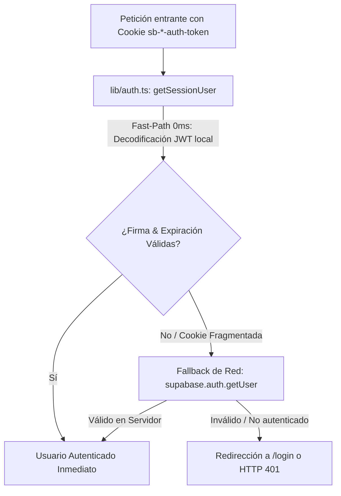

# ⚙️ Ficha Técnica: Auth Guard & Supabase SSR

> **Ruta:** `docs/features/auth_guard/ficha_tecnica.md`  
> **Estado:** `✅ HECHO` (En producción / Operativo)  
> **Capa Técnica:** Next.js Middleware / Server Components + Supabase SSR Auth + JWT Decoding + Prisma Sync

---

## 🛠️ 1. Pipeline de Verificación de Doble Capa

---

## 🔌 2. Endpoints y Funciones de Seguridad

- **`lib/auth.ts` (`getSessionUser`):**
  - Ensambla fragmentos de cookies de sesión (`.0`, `.1`).
  - Extrae el payload base64 del JWT sin llamadas de red para latencia cero.
  - Valida `exp` contra el tiempo Unix actual.
- **`/api/auth/sync` (`POST`):**
  - Sincroniza el UUID de `auth.users` de Supabase con el modelo `User` en `public`.
  - Asegura que todo nuevo usuario tenga asignado su registro de `Wallet` con 50 créditos iniciales y plan `FREE`.
- **`/api/auth/callback` (`GET`):**
  - Callback de intercambio de código de Google OAuth (`exchangeCodeForSession`).
  - Sincroniza atómicamente el UUID de Supabase con el modelo `User` de Prisma, provisiona la `Wallet` con bono inicial evaluado por anti-abuso, activa el plan `FREE` y gestiona la redirección fluida a `/dashboard`.
- **Supabase Vault RPC:**
  - Procedimientos almacenados para almacenar y desencriptar API keys (Google Gemini, OpenAI, Anthropic) sin exponer secretos en el cliente.

---

## 📂 3. Archivos Involucrados

- [`lib/auth.ts`](file:///e:/autoprod/lib/auth.ts): Doble capa de verificación de sesión.
- [`app/api/auth/callback/route.ts`](file:///e:/autoprod/app/api/auth/callback/route.ts): Callback oficial de Google OAuth y sincronización completa con PostgreSQL.
- [`app/api/auth/sync/route.ts`](file:///e:/autoprod/app/api/auth/sync/route.ts): Sincronización automática de perfil con PostgreSQL.
- [`app/api/settings/keys/route.ts`](file:///e:/autoprod/app/api/settings/keys/route.ts): Almacenamiento cifrado en Supabase Vault.
- [`components/auth/GoogleLoginButton.tsx`](file:///e:/autoprod/components/auth/GoogleLoginButton.tsx): Flujo de inicio de sesión con Google OAuth.
