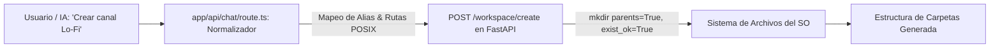

# ⚙️ Ficha Técnica: Gestión de Workspace & Carpetas (Folder CRUD)

> **Ruta:** `docs/features/folder_crud/ficha_tecnica.md`  
> **Estado:** `✅ HECHO` (En producción / Operativo)  
> **Capa Técnica:** Python FastAPI (Puerto 8000) + Next.js API Proxy + Zod Schemas en Prisma

---

## 🛠️ 1. Pipeline de Normalización y Creación de Carpetas

---

## 🔌 2. Endpoints de la API Local (`localhost:8000`)

| Endpoint | Método | Parámetros Clave | Descripción |
|---|:---:|---|---|
| `/workspace/` | `GET` | `{ path: string }` | Lista recursivamente el árbol de archivos hasta 4 niveles de profundidad. |
| `/workspace/pick` | `GET` | — | Lanza el explorador nativo de Windows (`PowerShell`) o macOS (`osascript`) para seleccionar carpeta. |
| `/workspace/create` | `POST` | `{ target_path, folders, folder_name, subfolders }` | Crea carpetas individuales o en bloque con anclaje automático a raíz de workspace. |
| `/workspace/delete_folder` | `POST` | `{ target_path, folders, folder_name }` | Eliminación segura de directorios con `shutil.rmtree` y búsqueda insensible a tildes/mayúsculas. |
| `/workspace/file` | `GET` / `POST` / `DELETE` | `{ path, content }` | Lectura, escritura y borrado de archivos de texto seguro (`.md`, `.txt`, `.srt`, `.vtt`, `.json`, etc.). |

---

## 📂 3. Archivos Involucrados

- [`controlador/routers/workspace.py`](file:///e:/autoprod/controlador/routers/workspace.py): Endpoints del sistema de archivos local en FastAPI.
- [`app/api/chat/route.ts`](file:///e:/autoprod/app/api/chat/route.ts): Normalizador de argumentos para las herramientas `crear_carpetas` y `eliminar_carpetas`.
- [`scripts/seed-orchestrator.ts`](file:///e:/autoprod/scripts/seed-orchestrator.ts): Schemas JSON de herramientas y directivas de rutas en Prisma.
- [`components/dashboard/FileTree.tsx`](file:///e:/autoprod/components/dashboard/FileTree.tsx): Visualizador interactivo del árbol de carpetas.
