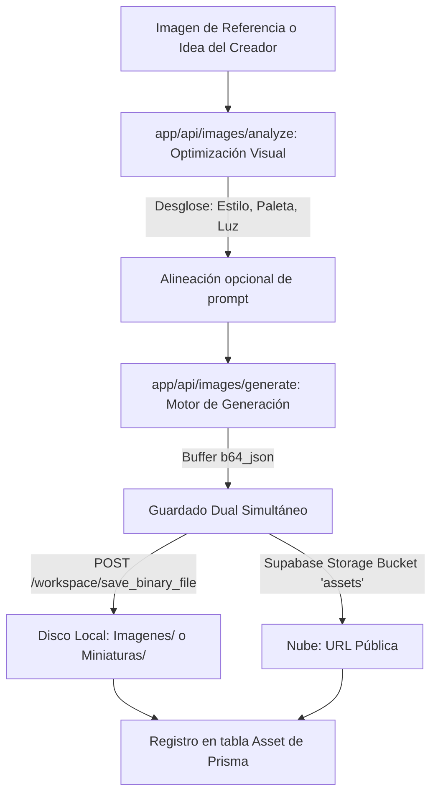

# ⚙️ Ficha Técnica: Image Studio (Estudio de Imágenes)

> **Ruta:** `docs/features/image_generator/ficha_tecnica.md`  
> **Estado:** `✅ HECHO` (En producción / Operativo)  
> **Capa Técnica:** Next.js API Routes + DALL-E 3 + OpenAI Vision + Supabase Storage + FastAPI Motor Local

---

## 🛠️ 1. Pipeline de Análisis Visual y Generación Dual

---

## 🔌 2. Endpoints de la API

| Endpoint | Método | Parámetros Clave | Descripción |
|---|:---:|---|---|
| `/api/images/analyze` | `POST` | `{ userIdea, imageBase64, channelName }` | Análisis de estilo con visión multimodal y optimización de descripción. |
| `/api/images/generate` | `POST` | `{ prompt, aspectRatio, channelId, channelName, customFileName, type }` | Genera imagen en alta resolución, guarda en disco local (`Imagenes/` o `Miniaturas/`) y respalda en Supabase. |
| `/workspace/save_binary_file` | `POST` (FastAPI) | `{ file_path, content_base64 }` | Escribe los bytes físicos de la imagen en la carpeta correspondiente del canal. |

---

## 🎛️ 3. Formatos y Relaciones de Aspecto

- **16:9 Panorámico (Horizontal):** Resolución nativa de alta definición para fondos de video, B-roll, ilustraciones de guion y portadas horizontales.
- **9:16 Vertical:** Proporción vertical para formatos móviles, videos cortos y pantallas verticales.
- **1:1 Cuadrado:** Proporción cuadrada universal para recursos gráficos, avatares y publicaciones de comunidad.

---

## 📂 4. Archivos Involucrados

- [`app/api/images/analyze/route.ts`](file:///e:/autoprod/app/api/images/analyze/route.ts): Endpoint de optimización visual asistida.
- [`app/api/images/generate/route.ts`](file:///e:/autoprod/app/api/images/generate/route.ts): Endpoint de generación y persistencia dual.
- [`controlador/routers/workspace.py`](file:///e:/autoprod/controlador/routers/workspace.py): Guardado físico en disco duro.
- [`components/dashboard/ImageStudio.tsx`](file:///e:/autoprod/components/dashboard/ImageStudio.tsx): Interfaz de creación interactiva con soporte `Ctrl+V`.
