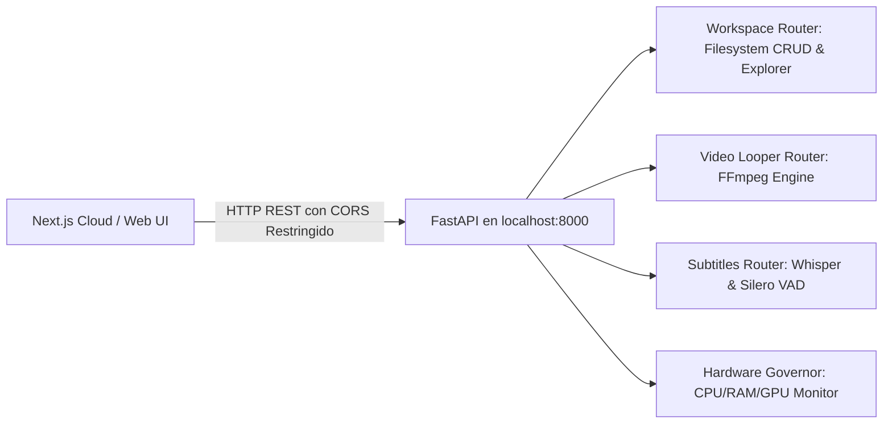

# ⚙️ Ficha Técnica: Motor Local (FastAPI Python `localhost:8000`)

> **Ruta:** `docs/features/local_motor/ficha_tecnica.md`  
> **Estado:** `✅ HECHO` (En producción / Operativo)  
> **Capa Técnica:** Python 3.10+ + FastAPI + Uvicorn + Subprocess OS

---

## 🛠️ 1. Arquitectura y Puentes de Comunicación

---

## 🔌 2. Configuración de Red, CORS y Routers

- **Host & Puerto:** `127.0.0.1:8000` (Uvicorn).
- **Inyección Automática de Binarios:** Al arrancar, `main.py` añade la subcarpeta `bin/` (`ffmpeg`, `yt-dlp`) al `PATH` de entorno.
- **Orígenes Permitidos (CORS):** Universal (`*`), permitiendo conexión fluida desde cualquier dominio de AutoProd (producción o desarrollo).
- **Routers Registrados en `main.py`:**
  - `/workspace`: Operaciones de directorios, lectura/escritura y selección nativa.
  - `/video`: Inspección de medios, escaneo de audio y render FFmpeg.
  - `/subtitles`: Estimación y transcripción con Faster-Whisper.

---

## 🔒 3. Disponibilidad y Accesibilidad

- **Plan Free (Trial) y Planes de Pago (Starter, Pro, Enterprise):** Acceso 100% habilitado para la descarga e instalación del Motor Local. Al correr en la máquina del usuario, AutoProd asume **costo cero de cómputo** mientras el creador experimenta máxima velocidad y soberanía de archivos.

---

## 📦 4. Distribución Profesional (Windows Setup & macOS DMG)

- **Windows (`AutoProd-Setup.exe`):** Compilado con **Inno Setup** ([`scripts/installer/windows/setup.iss`](file:///e:/autoprod/scripts/installer/windows/setup.iss)) y automatizado en [`scripts/build/build-windows.bat`](file:///e:/autoprod/scripts/build/build-windows.bat).
  - Asistente gráfico nativo con branding oficial e idiomas (Español / Inglés).
  - Instalación de `autoprod-motor.exe`, `bin/` (`ffmpeg.exe`, `yt-dlp.exe`), configuración inicial y accesos directos en Escritorio y Menú Inicio.
  - Generador de desinstalador limpio en Panel de Control.
- **macOS (`AutoProd-Setup.dmg`):** Empaquetador nativo en [`scripts/build/build-macos.sh`](file:///e:/autoprod/scripts/build/build-macos.sh) para distribución en imagen de disco DMG / paquete `.app`.
- **Cero Terminales y Cero Código Expuesto:** El usuario final solo descarga un archivo `.exe` o `.dmg` y sigue el asistente visual en 1 clic.
- **Endpoint de Entrega:** [`app/api/setup/download-installer/route.ts`](file:///e:/autoprod/app/api/setup/download-installer/route.ts) con redirección automática al CDN de GitHub Releases oficial (`ma730dev/AutoProdAI`) o entrega del instalador binario compilado local.

---

## 📂 5. Archivos Involucrados

- [`controlador/main.py`](file:///e:/autoprod/controlador/main.py): Entrada de Uvicorn, soporte para binario congelado (`sys.frozen` / `freeze_support`), CORS y montaje de routers.
- [`scripts/build/build-windows.bat`](file:///e:/autoprod/scripts/build/build-windows.bat): Generador de `autoprod-motor.exe` y empaquetador `AutoProd-Setup.exe`.
- [`scripts/build/build-macos.sh`](file:///e:/autoprod/scripts/build/build-macos.sh): Generador de binario y empaquetador `AutoProd-Setup.dmg`.
- [`scripts/installer/windows/setup.iss`](file:///e:/autoprod/scripts/installer/windows/setup.iss): Script oficial de Inno Setup.
- [`controlador/routers/workspace.py`](file:///e:/autoprod/controlador/routers/workspace.py): CRUD y lectura dinámica de `.autoprod-config.json`.
- [`controlador/routers/video_looper.py`](file:///e:/autoprod/controlador/routers/video_looper.py): Procesamiento FFmpeg.
- [`controlador/routers/subtitles.py`](file:///e:/autoprod/controlador/routers/subtitles.py): Transcripción de audio Whisper.
- [`lib/controlador-client.ts`](file:///e:/autoprod/lib/controlador-client.ts): Conector HTTP TypeScript cliente.
- [`app/api/setup/download-installer/route.ts`](file:///e:/autoprod/app/api/setup/download-installer/route.ts): Endpoint de entrega directa del instalador.

