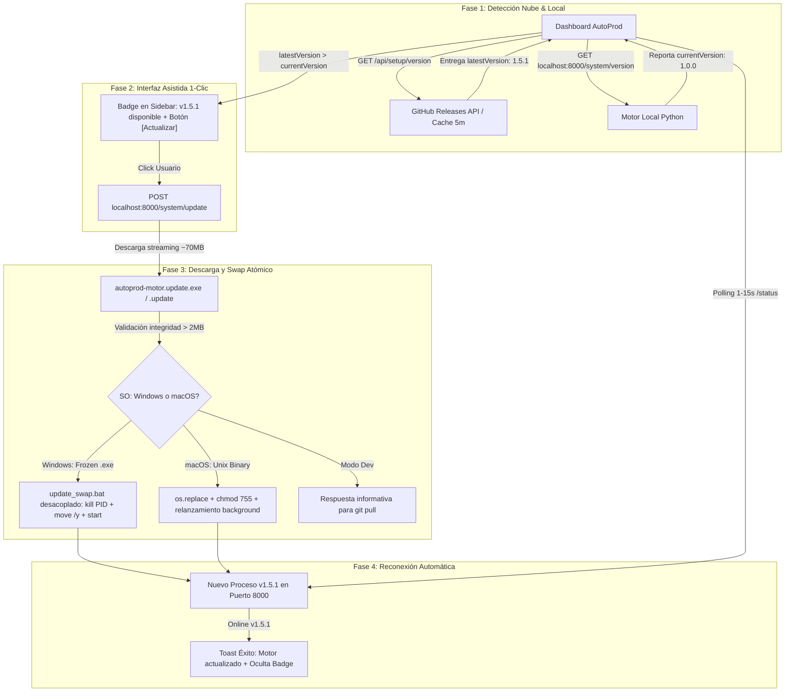

# ⚙️ Ficha Técnica: Auto-Update del Motor Local & Notificación 1-Clic (`FEAT-22`)

> **Ruta:** `docs/features/motor_auto_update/ficha_tecnica.md`  
> **Estado:** `✅ HECHO`  
> **Capa Técnica:** FastAPI (Python) + Next.js App Router (TypeScript) + GitHub Releases CDN + In-Memory Caching + Atomic Process Swap (Windows `.bat` & macOS `os.replace`)

---

## 🛠️ 1. Arquitectura y Flujo de Actualización Ligero



---

## 🔌 2. Endpoints y Contratos de Datos

### A. Endpoint Cloud: Verificador de Versiones
- **Ruta:** `GET /api/setup/version`
- **Archivo:** [`app/api/setup/version/route.ts`](file:///e:/autoprod/app/api/setup/version/route.ts)
- **Caché:** En memoria (TTL = 300 segundos / 5 minutos) para respetar límites de GitHub API.
- **Respuesta:**
  ```json
  {
    "success": true,
    "tag": "v1.5.1",
    "version": "1.5.1",
    "publishedAt": "2026-09-25T12:00:00Z",
    "assets": {
      "windowsBinary": "https://github.com/ma730dev/AutoProdAI/releases/download/v1.5.1/autoprod-motor.exe",
      "macBinary": "https://github.com/ma730dev/AutoProdAI/releases/download/v1.5.1/autoprod-motor",
      "windowsInstaller": "https://github.com/ma730dev/AutoProdAI/releases/download/v1.5.1/AutoProd-Setup.exe",
      "macInstaller": "https://github.com/ma730dev/AutoProdAI/releases/download/v1.5.1/AutoProd-Setup.dmg"
    },
    "notes": "Notas de la release...",
    "htmlUrl": "https://github.com/ma730dev/AutoProdAI/releases/tag/v1.5.1"
  }
  ```

### B. Endpoints del Motor Local (Python FastAPI)
- **Archivo:** [`controlador/routers/system.py`](file:///e:/autoprod/controlador/routers/system.py) (incluido en [`controlador/main.py`](file:///e:/autoprod/controlador/main.py))

#### 1. Versión y Estado de Entorno
- **Ruta:** `GET /system/version`
- **Respuesta:**
  ```json
  {
    "version": "1.0.0",
    "platform": "win32",
    "is_frozen": true,
    "executable": "C:\\Program Files\\AutoProdAI\\autoprod-motor.exe",
    "base_dir": "C:\\Program Files\\AutoProdAI"
  }
  ```

#### 2. Disparo de Actualización
- **Ruta:** `POST /system/update`
- **Body Opcional:**
  ```json
  {
    "download_url": "https://github.com/ma730dev/AutoProdAI/releases/download/v1.5.1/autoprod-motor.exe",
    "version": "1.5.1"
  }
  ```
- **Respuesta:**
  ```json
  {
    "status": "updating",
    "message": "Actualización a v1.5.1 descargada correctamente (74 MB). El motor se reiniciará en unos segundos.",
    "current_version": "1.0.0",
    "target_version": "1.5.1"
  }
  ```

---

## 🎛️ 3. Mecanismo de Swap Atómico (Zero-Interruption)

### A. Windows (Superando el File Lock del Kernel)
En Windows, un proceso en ejecución bloquea su `.exe`. El motor crea y ejecuta de forma desacoplada (`creationflags=0x00000008` DETACHED_PROCESS) el script auxiliar `update_swap.bat`:
```bat
@echo off
timeout /t 1 /nobreak >nul
taskkill /F /PID %1 >nul 2>&1
move /y "autoprod-motor.update.exe" "autoprod-motor.exe" >nul 2>&1
start "" "autoprod-motor.exe"
del "%~f0"
```
El proceso actual llama a `os._exit(0)`, liberando el puerto 8000. El script batch intercambia el archivo e inicia el nuevo motor en menos de 2 segundos.

### B. macOS / Linux (UNIX)
En UNIX, los archivos abiertos admiten desvinculación o reemplazo atómico mediante llamada al sistema `os.replace`:
```python
os.replace(temp_path, target_exe)
os.chmod(target_exe, 0o755)
subprocess.Popen(["/bin/bash", "-c", f"sleep 1 && '{target_exe}' &"], start_new_session=True)
os._exit(0)
```

---

## 📦 4. Publicación en CI/CD (`.github/workflows/release-installers.yml`)

El pipeline de GitHub Actions compila y sube tanto los instaladores completos como los binarios ligeros sueltos:
- `dist/AutoProd-Setup.exe` (Instalador completo Windows con FFmpeg/yt-dlp)
- `dist/AutoProd-Setup.dmg` (Instalador completo macOS)
- `dist/autoprod-motor.exe` (Binario ligero para auto-update)
- `dist/autoprod-motor` (Binario ligero para auto-update)

---

## 🖥️ 5. Archivos Involucrados

| Componente | Archivo | Rol |
|---|---|---|
| CI/CD GitHub Actions | [`.github/workflows/release-installers.yml`](file:///e:/autoprod/.github/workflows/release-installers.yml) | Empaquetado y publicación de binarios ligeros |
| Endpoint Cloud | [`app/api/setup/version/route.ts`](file:///e:/autoprod/app/api/setup/version/route.ts) | Verificación de versión remota con caché |
| Router Local Python | [`controlador/routers/system.py`](file:///e:/autoprod/controlador/routers/system.py) | Endpoints `/system/version` y `/system/update` |
| Servidor Local Python | [`controlador/main.py`](file:///e:/autoprod/controlador/main.py) | Registro del router `system` |
| Build Scripts | [`harness/build/compile-exe.ts`](file:///e:/autoprod/harness/build/compile-exe.ts), [`scripts/build/build-windows.bat`](file:///e:/autoprod/scripts/build/build-windows.bat), [`scripts/build/build-macos.sh`](file:///e:/autoprod/scripts/build/build-macos.sh) | Inclusión de `--hidden-import "routers.system"` |
| Cliente Frontend | [`lib/controlador-client.ts`](file:///e:/autoprod/lib/controlador-client.ts) | Métodos `getMotorVersion()`, `checkRemoteReleaseVersion()`, `triggerMotorUpdate()` |
| Barra Lateral UI | [`components/chat/ConversationSidebar.tsx`](file:///e:/autoprod/components/chat/ConversationSidebar.tsx) | Badge `🟣 vX.X.X disponible` y botón `[Actualizar]` |
| Orquestación Dashboard | [`app/dashboard/page.tsx`](file:///e:/autoprod/app/dashboard/page.tsx) | Detección periódica, toasts y reconexión automática |
