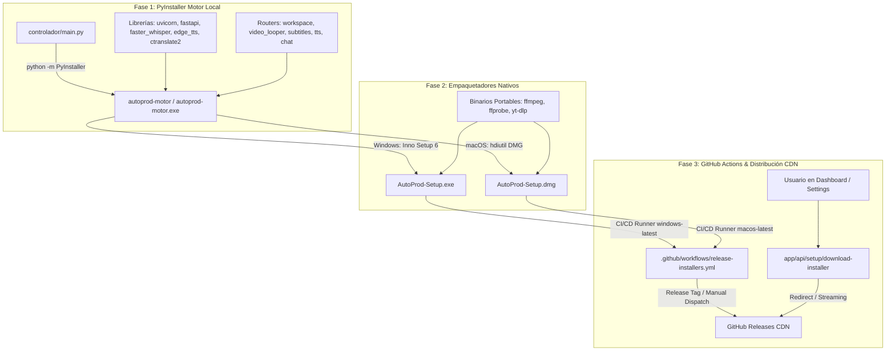

# ⚙️ Ficha Técnica: Instalador Autónomo & Empaquetado (`AutoProd-Setup.exe` & `AutoProd-Setup.dmg`)

> **Ruta:** `docs/features/standalone_installer/ficha_tecnica.md`  
> **Estado:** `✅ HECHO (Windows: AutoProd-Setup.exe & macOS: AutoProd-Setup.dmg)`  
> **Capa Técnica:** PyInstaller (One-File) + Inno Setup 6 + macOS hdiutil (.dmg) + GitHub Actions Multiplataforma + GitHub Releases CDN + Next.js API Routes

---

## 🛠️ 1. Pipeline de Compilación & Empaquetado Multiplataforma



---

## 🔌 2. Endpoints, CI/CD y Automatización de Arneses

### A. Endpoint de Descarga Oficial

| Endpoint | Método | Parámetros Clave | Descripción |
|---|:---:|---|---|
| `/api/setup/download-installer` | `GET` | `os?: 'windows' \| 'mac'` | Sirve el instalador oficial para el sistema operativo detectado o solicitado (`AutoProd-Setup.exe` o `AutoProd-Setup.dmg`). Consulta automáticamente la última release pública en GitHub con fallback al binario local en `dist/`. |

### B. Comandos Oficiales de Compilación (Harness)

1. **Compilación de Windows:**
   ```bash
   pnpm build:exe
   ```
   * **Script:** [`harness/build/compile-exe.ts`](file:///e:/autoprod/harness/build/compile-exe.ts) y [`scripts/build/build-windows.bat`](file:///e:/autoprod/scripts/build/build-windows.bat).

2. **Compilación de macOS:**
   ```bash
   pnpm build:mac
   ```
   * **Script:** [`harness/build/compile-mac.ts`](file:///e:/autoprod/harness/build/compile-mac.ts) y [`scripts/build/build-macos.sh`](file:///e:/autoprod/scripts/build/build-macos.sh).

3. **Compilación Automatizada en la Nube (GitHub Actions):**
   * **Workflow:** [`.github/workflows/release-installers.yml`](file:///e:/autoprod/.github/workflows/release-installers.yml).
   * Corre runners paralelos en `windows-latest` y `macos-latest` para generar ambos binarios sin requerir hardware Mac local, publicando directamente en GitHub Releases.

---

## 🎛️ 3. Especificaciones de Instalación

### Windows (`setup.iss` & `install-windows.bat`):
- **Ubicación:** [`scripts/installer/windows/setup.iss`](file:///e:/autoprod/scripts/installer/windows/setup.iss) & [`scripts/installer/install-windows.bat`](file:///e:/autoprod/scripts/installer/install-windows.bat)
- **Directorio:** `{autopf}\AutoProdAI` o ruta elegida por el usuario.
- **Componentes:** `autoprod-motor.exe`, `.autoprod-config.json` (apuntando a `workspace\youtube`), `bin/` (`ffmpeg.exe`, `ffprobe.exe`, `yt-dlp.exe`), `workspace/youtube/Canal_1/` con los 6 módulos (`InfoCanal/`, `Guiones/`, `Videos/`, `Miniatura/`, `Musica/`, `Imagenes/`) y plantillas Markdown base pre-generadas (`Contexto_canal.md`, `Metricas_canal.md`, `Historial_canal.md`, `Plantilla_Guion.md`, `Ideas_Miniaturas.md`).

### macOS (`build-macos.sh` / `AutoProd-Setup.dmg` / `install-macos.sh`):
- **Ubicación:** [`scripts/build/build-macos.sh`](file:///e:/autoprod/scripts/build/build-macos.sh) & [`scripts/installer/install-macos.sh`](file:///e:/autoprod/scripts/installer/install-macos.sh)
- **Directorio:** `~/AutoProdAI`
- **Componentes:** `autoprod-motor`, `start_motor.sh`, `.autoprod-config.json` (apuntando a `workspace/youtube`), `bin/` (`ffmpeg`, `yt-dlp`), `workspace/youtube/Canal_1/` con la misma estructura canónica de 6 módulos y recursos Markdown iniciales.

---

## 📂 4. Archivos Involucrados

- [`.github/workflows/release-installers.yml`](file:///e:/autoprod/.github/workflows/release-installers.yml): Pipeline de CI/CD para compilar y publicar releases para Windows y macOS.
- [`scripts/build/build-macos.sh`](file:///e:/autoprod/scripts/build/build-macos.sh): Script de compilación y creación de `.dmg` para macOS.
- [`scripts/build/build-windows.bat`](file:///e:/autoprod/scripts/build/build-windows.bat): Script batch de compilación completa para Windows.
- [`scripts/installer/windows/setup.iss`](file:///e:/autoprod/scripts/installer/windows/setup.iss): Definición formal de Inno Setup.
- [`harness/build/compile-exe.ts`](file:///e:/autoprod/harness/build/compile-exe.ts): Arnés oficial para Windows (`pnpm build:exe`).
- [`harness/build/compile-mac.ts`](file:///e:/autoprod/harness/build/compile-mac.ts): Arnés oficial para macOS (`pnpm build:mac`).
- [`app/api/setup/download-installer/route.ts`](file:///e:/autoprod/app/api/setup/download-installer/route.ts): Endpoint de entrega directa y streaming CDN.
- [`controlador/main.py`](file:///e:/autoprod/controlador/main.py): Manejo de ejecución en modo binario congelado (`getattr(sys, 'frozen', False)`).
