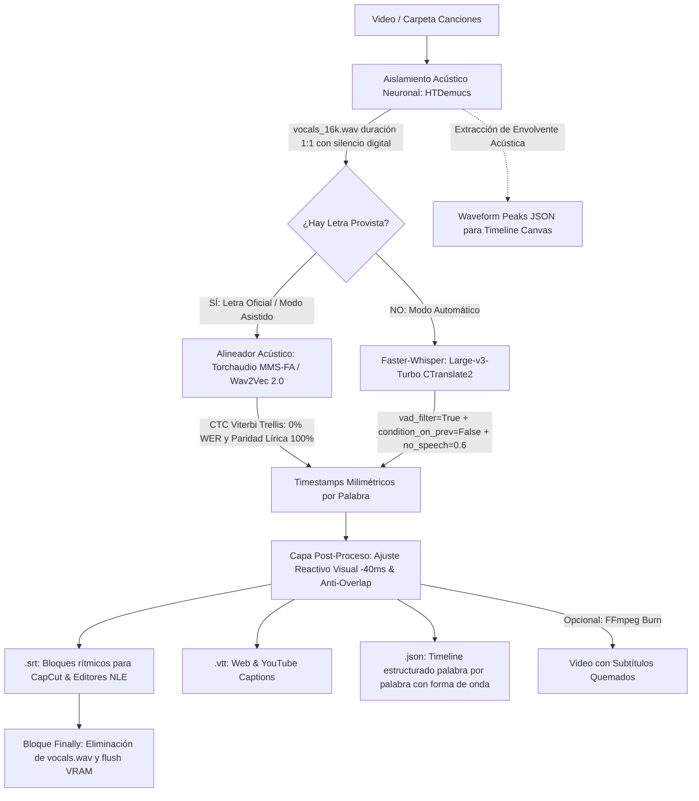

# ⚙️ Ficha Técnica: Subtitulador Musical de Doble Vía (HTDemucs + CTC Viterbi Trellis / Whisper)

> **Ruta:** `docs/features/subtitles_whisper/ficha_tecnica.md`  
> **Estado:** `✅ HECHO` (En producción / Operativo)  
> **Capa Técnica:** Python FastAPI (Puerto 8000) + HTDemucs (Separación Acústica Neuronal 1:1) + Torchaudio MMS-FA / Wav2Vec 2.0 (CTC Viterbi Trellis 0% WER) + Faster-Whisper Large-v3-Turbo + Ajuste Reactivo Visual (-40ms) + Timeline Waveform Canvas + FFmpeg + Next.js

---

## 🛠️ 1. Pipeline de Procesamiento de Audio & Transcripción de Doble Vía

---

## 🎵 2. Optimizaciones Especializadas para Música y Letras Líricas

Para resolver la pérdida de palabras, las alucinaciones en compases instrumentales y el desfase biológico de lectura, se implementaron cuatro capas de procesamiento:
1. **Aislamiento Acústico Neuronal (HTDemucs):** Extrae la pista de voz a capela pura (`vocals.wav`). Los instrumentos se transforman en **silencio digital puro (0 dBFS)** manteniendo la duración 1:1 estricta del audio original sin desfasar el video maestro.
2. **Modo Asistido con CTC Viterbi Trellis (`torchaudio.pipelines.MMS_FA`):** Si el creador proporciona la letra oficial, se bypasea Whisper por completo. El modelo fonético acústico calcula en qué milisegundo exacto de la onda limpia ocurre cada palabra, garantizando **0% de errores léxicos (0% WER) y 100% de paridad lírica**.
3. **Modo Automático Anti-Alucinaciones (Faster-Whisper Large-v3-Turbo):** Ejecutado sobre el acapela limpio con `vad_filter=True`, `min_silence_duration_ms=1000`, `condition_on_previous_text=False` y `no_speech_threshold=0.60`. Ignora los solos instrumentales sin generar bucles de texto fantasma.
4. **Capa de Ajuste Reactivo Visual (-40ms) & Anti-Overlap:** Resta 40 ms al inicio de cada subtítulo para compensar la latencia visual humana y resuelve colisiones para que ninguna palabra solape el inicio de la siguiente.
5. **Forma de Onda en Timeline Canvas:** Genera un array de amplitudes normalizadas (`waveform`) de <50 KB para renderizar los picos acústicos de voz en el componente `TimelinePro`.

---

## 🔌 3. Endpoints de la API Local (`localhost:8000`)

| Endpoint | Método | Parámetros Clave | Descripción |
|---|:---:|---|---|
| `/subtitles/estimate` | `POST` | `{ path, target_type, engine }` | Evalúa la duración total del audio y el hardware disponible para estimar tiempo de ejecución. |
| `/subtitles/generate` | `POST` | `{ path, target_type, lyrics_text, engine, language, formats, burn_to_video }` | Inicia el pipeline de HTDemucs, doble vía (Asistido/Automático), ajuste reactivo y guardado. |
| `/subtitles/status/{job_id}` | `GET` | `job_id` en path | Emite el progreso en tiempo real (`progress`, `current_track`, `results`, `status`). |
| `/subtitles/preview_file` | `GET` | `path` en query | Lee el contenido de un archivo `.srt`, `.vtt` o `.json` para renderizarlo en el editor web. |
| `/subtitles/save_file` | `POST` | `{ path, content }` | Guarda modificaciones manuales de texto o marcas de tiempo realizadas en la UI. |

---

## ⚡ 4. Hardware Governor & Políticas de Recursos

Implementado en [`controlador/hardware.py`](file:///e:/autoprod/controlador/hardware.py):
1. **Detección de Entorno:**
   - Núcleos de CPU vía `os.cpu_count()`.
   - Memoria RAM total y disponible vía API nativa de Windows `GlobalMemoryStatusEx` (`ctypes`).
   - Aceleradores GPU disponibles (NVIDIA CUDA con fallback automático a CPU INT8).
2. **Aislamiento de Hilos:**
   - Asignación inteligente: 1 hilo en equipos ultraligeros (≤4GB RAM), 2 hilos en CPUs de 4 núcleos, 3 a 4 hilos en CPUs de 8 a 12+ núcleos. Deja siempre núcleos libres para evitar congelamientos en Windows.
3. **Semáforo de Exclusión Mutua:**
   - Impide que un render de Video Looper y una transcripción pesada de Whisper se ejecuten al mismo tiempo, encolándolos en memoria.
4. **Liberación Inmediata de RAM:**
   - Tras completar la transcripción, `release_whisper_model()` vacía el modelo de la memoria RAM y ejecuta recolección de basura (`gc.collect()`).

---

## 📂 5. Archivos Involucrados

- [`controlador/hardware.py`](file:///e:/autoprod/controlador/hardware.py): Detección de CPU, RAM, GPU, gobernador de concurrencia y selección adaptativa de perfil Whisper (`for_music=True`).
- [`controlador/routers/subtitles.py`](file:///e:/autoprod/controlador/routers/subtitles.py): Rutas de FastAPI para estimación acústica, aislamiento estéreo vocal, Faster-Whisper Large-v3-Turbo y formateo rítmico CapCut.
- [`lib/controlador-client.ts`](file:///e:/autoprod/lib/controlador-client.ts): Métodos TypeScript (`estimateSubtitles`, `generateSubtitles`, `getSubtitlesStatus`, `previewSubtitleFile`, `saveSubtitleFile`).
- [`components/dashboard/PreExecutionEstimateModal.tsx`](file:///e:/autoprod/components/dashboard/PreExecutionEstimateModal.tsx): Modal con diagnósticos de hardware antes de ejecutar.
- [`components/dashboard/VideoSubtitlesStudio.tsx`](file:///e:/autoprod/components/dashboard/VideoSubtitlesStudio.tsx): Interfaz de subtitulado individual y por carpetas con editor integrado.
- [`components/video-studio/VideoStudio.tsx`](file:///e:/autoprod/components/video-studio/VideoStudio.tsx): Generación y colocación de subtítulos en la pista S1 del Timeline Pro.
