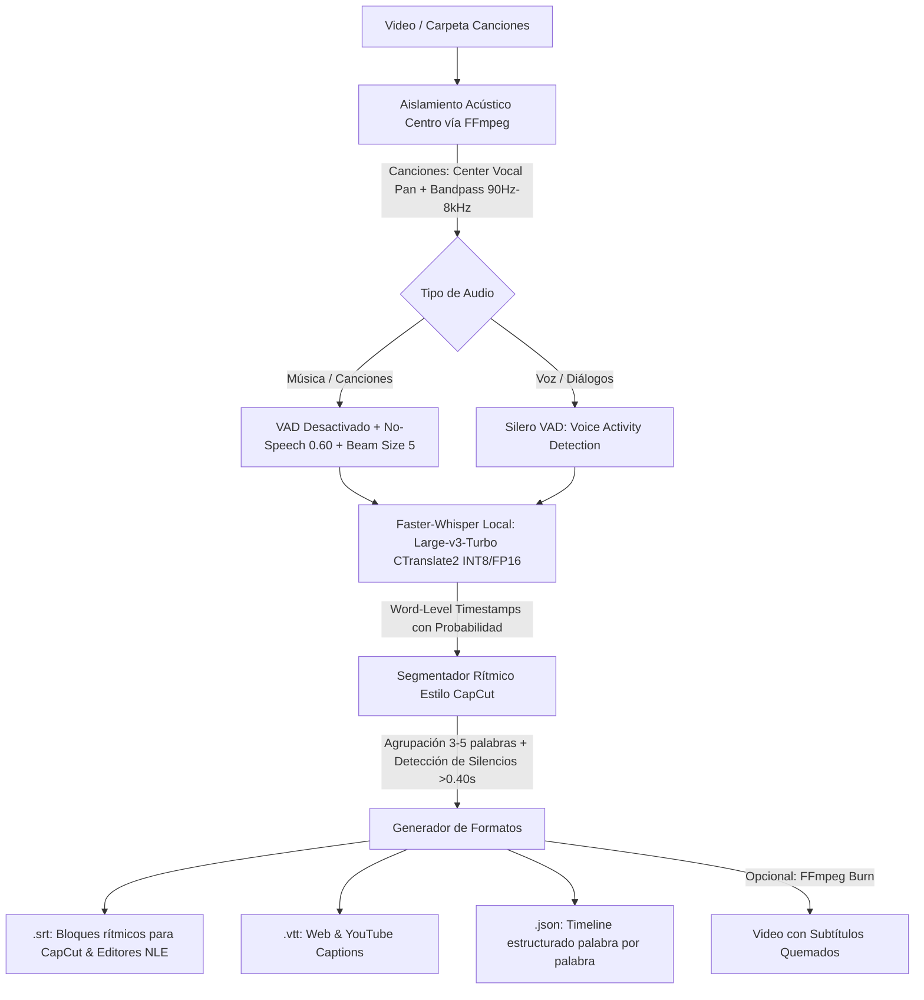

# ⚙️ Ficha Técnica: Subtitulador Whisper & Hardware Governor

> **Ruta:** `docs/features/subtitles_whisper/ficha_tecnica.md`  
> **Estado:** `✅ HECHO` (En producción / Operativo)  
> **Capa Técnica:** Python FastAPI (Puerto 8000) + Faster-Whisper Large-v3-Turbo (CTranslate2 Local INT8 / CUDA FP16) + Aislamiento Acústico Centro + Segmentación Rítmica CapCut + FFmpeg + Next.js

---

## 🛠️ 1. Pipeline de Procesamiento de Audio & Transcripción

---

## 🎵 2. Optimizaciones Especializadas para Canciones y Letras Líricas

Para resolver la pérdida de palabras y las alucinaciones en canciones con instrumentales pesados, se implementaron cuatro capas de procesamiento:
1. **Aislamiento Acústico de Voz en Centro Estéreo:** En vez de mezclar ciegamente o usar normalizadores dinámicos agresivos (`dynaudnorm`, que subían el volumen de los instrumentos hasta 15 dB durante los silencios del cantante), se utiliza un filtro estéreo central `pan=mono|c0=0.5*c0+0.5*c1` junto con filtrado pasa-altos a 90 Hz y pasa-bajos a 8 kHz, enfocando la energía acústica en el rango de los formantes vocales humanos.
2. **Desactivación de Silero VAD en Música:** Silero VAD está entrenado en lenguaje hablado. En canciones, clasifica erróneamente notas sostenidas y melodías como ruido de fondo, cortando versos enteros antes de que lleguen a Whisper. Al desactivarlo en canciones e incrementar el umbral de `no_speech_threshold` a `0.60`, el transcriptor escucha cada compás sin recortes.
3. **Motor Local Large-v3-Turbo (1,550M Parámetros):** Reemplazo del modelo liviano `small`/`base` por el modelo insignia de OpenAI `large-v3-turbo` cuantizado en INT8 (vía CTranslate2). Utiliza 4x menos VRAM y RAM que el PyTorch original, permitiendo ejecutar la máxima precisión de OpenAI al 100% en local y a $0 costo.
4. **Segmentador Rítmico Dinámico Estilo CapCut (`format_capcut_rhythmic_segments`):** En lugar de generar párrafos extensos de 15 a 30 segundos, agrupa las palabras en bloques ágiles de 3 a 5 palabras, dividiendo los subtítulos cuando detecta una pausa lírica superior a 400 milisegundos (`max_pause_sec = 0.40`) o signos de puntuación clave.

---

## 🔌 3. Endpoints de la API Local (`localhost:8000`)

| Endpoint | Método | Parámetros Clave | Descripción |
|---|:---:|---|---|
| `/subtitles/estimate` | `POST` | `{ path, target_type, engine }` | Evalúa la duración total del audio y el hardware disponible para estimar tiempo de ejecución. |
| `/subtitles/generate` | `POST` | `{ path, target_type, engine, language, formats, burn_to_video }` | Inicia el pipeline de extracción acústica, Faster-Whisper y guardado de archivos. |
| `/subtitles/status/{job_id}` | `GET` | `job_id` en path | Emite el progreso en tiempo real (`progress`, `current_track`, `results`, `status`). |
| `/subtitles/preview_file` | `GET` | `path` en query | Lee el contenido de un archivo `.srt`, `.vtt` o `.json` para renderizarlo en el editor web. |
| `/subtitles/save_file` | `POST` | `{ path, content }` | Guarda modificaciones manuales de texto o marcas de tiempo realizadas en la UI. |

---

## ⚡ 4. Hardware Governor & Políticas de Recursos

Implementado en [`controlador/hardware.py`](file:///e:/autoprod/controlador/hardware.py):
1. **Detección de Entorno:**
   - Núcleos de CPU vía `os.cpu_count()`.
   - Memoria RAM total y disponible vía API nativa de Windows `GlobalMemoryStatusEx` (`ctypes`).
   - Aceleradores GPU disponibles (NVIDIA CUDA con fallback automático a CPU INT8).
2. **Aislamiento de Hilos:**
   - Asignación inteligente: 1 hilo en equipos ultraligeros (≤4GB RAM), 2 hilos en CPUs de 4 núcleos, 3 a 4 hilos en CPUs de 8 a 12+ núcleos. Deja siempre núcleos libres para evitar congelamientos en Windows.
3. **Semáforo de Exclusión Mutua:**
   - Impide que un render de Video Looper y una transcripción pesada de Whisper se ejecuten al mismo tiempo, encolándolos en memoria.
4. **Liberación Inmediata de RAM:**
   - Tras completar la transcripción, `release_whisper_model()` vacía el modelo de la memoria RAM y ejecuta recolección de basura (`gc.collect()`).

---

## 📂 5. Archivos Involucrados

- [`controlador/hardware.py`](file:///e:/autoprod/controlador/hardware.py): Detección de CPU, RAM, GPU, gobernador de concurrencia y selección adaptativa de perfil Whisper (`for_music=True`).
- [`controlador/routers/subtitles.py`](file:///e:/autoprod/controlador/routers/subtitles.py): Rutas de FastAPI para estimación acústica, aislamiento estéreo vocal, Faster-Whisper Large-v3-Turbo y formateo rítmico CapCut.
- [`lib/controlador-client.ts`](file:///e:/autoprod/lib/controlador-client.ts): Métodos TypeScript (`estimateSubtitles`, `generateSubtitles`, `getSubtitlesStatus`, `previewSubtitleFile`, `saveSubtitleFile`).
- [`components/dashboard/PreExecutionEstimateModal.tsx`](file:///e:/autoprod/components/dashboard/PreExecutionEstimateModal.tsx): Modal con diagnósticos de hardware antes de ejecutar.
- [`components/dashboard/VideoSubtitlesStudio.tsx`](file:///e:/autoprod/components/dashboard/VideoSubtitlesStudio.tsx): Interfaz de subtitulado individual y por carpetas con editor integrado.
- [`components/video-studio/VideoStudio.tsx`](file:///e:/autoprod/components/video-studio/VideoStudio.tsx): Generación y colocación de subtítulos en la pista S1 del Timeline Pro.
