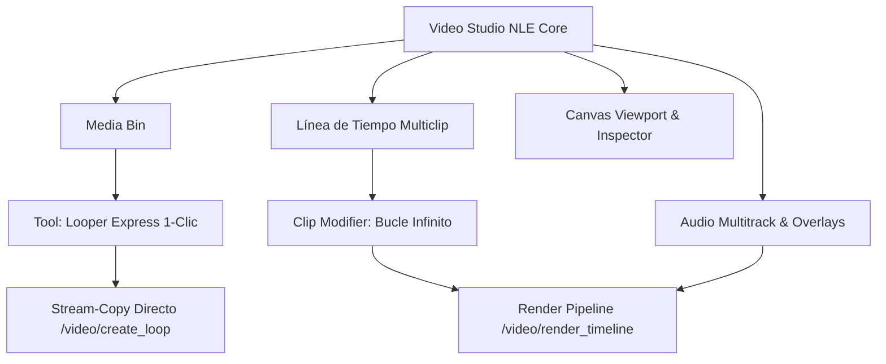

# 💡 Idea & Escalabilidad: Video Studio & Timeline Editor

> **Ruta:** `docs/features/video_looper/idea.md`  
> **Propósito:** Editor de video no lineal (NLE) ágil y soberano en el navegador, con montaje multiclip, recorte interactivo, pistas de música, overlays y exportación GPU.

---

## 🎯 1. El Problema & La Visión de Producto

- **El Problema:** Para crear un video de YouTube, Reel o podcast ambiental, los creadores debían abrir editores hiperpesados (Premiere, DaVinci Resolve) o ceder su privacidad y cuotas mensuales en suites web lentas que re-comprimen todo en la nube. Además, para canales de música Lo-Fi o fondos relajantes, duplicar clips manualmente y calcular duraciones era una tarea repetitiva y propensa a saltos de audio.
- **La Solución AutoProd:** Un **Video Studio NLE completo** que corre nativamente en el navegador conectado al Motor Local (`localhost:8000`). El creador tiene:
  1. **Montaje No Lineal (Core):** Biblioteca de medios, línea de tiempo con recorte interactivo (In/Out handles), reordenamiento de cortes por arrastre, canvas multi-relación de aspecto (16:9, 9:16 Shorts, 1:1) e inspector contextual en tiempo real.
  2. **Looper Express Integrado (Feature):** Generación de bucles infinitos de 1 a 3 horas sincronizados automáticamente con carpetas de música en segundos mediante *Stream Copy* (`-c:v copy`), o activable como propiedad de clip individual en la línea de tiempo.
  3. **Audio Multitrack:** Mezcla multitrack (voz, video y pistas musicales) con niveles de volumen independientes.
  4. **Overlays & Textos:** Títulos, CTAs y marcas de agua arrastrables sobre el canvas.
  5. **Costo Cero & Privacidad Absoluta:** Renderizado acelerado por GPU local (NVENC / VideoToolbox / CPU libx264). Tus archivos nunca abandonan tu máquina.

---

## 📊 2. Matriz de Alcance: Lo Hecho vs. Lo Faltante

| Capacidad | Estado | Descripción / Comentario |
|---|:---:|---|
| **Arquitectura NLE (Media Bin + Canvas + Inspector + Timeline)** | `✅ HECHO` | Interfaz de 3 columnas estilo editor profesional con reproductor central y línea de tiempo inferior. |
| **Línea de Tiempo Multiclip Interactiva** | `✅ HECHO` | Recorte visual de puntos de entrada y salida (Handles In/Out) con límites seguros (`>= 0.3s`) y recálculo en tiempo real. |
| **Reordenamiento Secuencial por Arrastre (Drag & Drop)** | `✅ HECHO` | Reorganización ágil de cortes en la pista de video arrastrando clips directamente en la línea de tiempo. |
| **Multi-Aspect Ratio Canvas (16:9, 9:16 Shorts, 1:1, 4:5, 21:9)** | `✅ HECHO` | Encuadre visual dinámico y escalado automático (`scale=w:h:force_original_aspect_ratio,pad`) en exportación. |
| **Inspector Contextual Reactivo** | `✅ HECHO` | Inspección detallada del clip seleccionado (In/Out, volumen, toggle de bucle), del overlay de texto o del proyecto global. |
| **Mezcla de Audio Multitrack** | `✅ HECHO` | Pipeline `amix` con balance independiente de volumen para voz, video original y pistas de música. |
| **Multipista de Audio (Múltiples Canciones en A1)** | `✅ HECHO` | Subida múltiple, audición rápida previa (`▶ / ⏸`), inserción en cascada y recorte/arrastre individual en la pista A1 con mezcla GPU `adelay` + `atrim`. |
| **Duración de Secuencia Basada en Elementos (Modelo Premiere)** | `✅ HECHO` | La duración maestra del proyecto la define el elemento más lejano en cualquier pista (V1, A1, T1), sin truncar audio ni overlays distantes. |
| **Zoom Panorámico Elástico & Fit to View** | `✅ HECHO` | Rango de escala de `0.2 px/s` a `60 px/s` para visualizar proyectos de 30m a 1h+ en una sola pantalla, con botón de ajuste automático `Shift+Z`. |
| **Soporte de Huecos (Black Slug Fallback)** | `✅ HECHO` | Reproducción continua sobre tramos sin video: el canvas muestra fondo negro limpio y la música/etiquetas continúan activas sin frenar el cabezal. |
| **Asistente Smart Sync (Detección de Discrepancia V/A)** | `✅ HECHO` | Detección contextual cuando la música dura más que los videos, con acciones de 1-clic: bucle continuo o recorte al video. |
| **Overlays de Texto & CTAs Arrastrables** | `✅ HECHO` | Capas de texto posicionables en DOM y renderizadas con precisión vía `drawtext` en backend. |
| **Calidad Anti-Pixelado H.264 (CRF Puro + AQ-mode 3)** | `✅ HECHO` | Perfiles CRF 12 (Master), 15 (Alta Nitidez) y 18 (Equilibrado) con `aq-mode=3` para fondos oscuros espaciales y partículas. |
| **Aceleración por Hardware GPU** | `✅ HECHO` | Detección y uso automático de encoders por hardware (`h264_nvenc` en NVIDIA, `h264_videotoolbox` en Apple Silicon, fallback a `libx264`). |
| **Función de Bucle Profesional y Bloque Amarillo Elástico** | `✅ HECHO` | Integrado en Inspector (`-Video -> ------Looper`), selección multi-clip desde medios de proyecto (sin requerir estar en timeline), bloque amarillo elástico en V1 con manilla de arrastre, muescas visuales de ciclo y cálculo exacto de repeticiones sin saturar el DOM. |
| **Transiciones Suaves Entre Cortes (Crossfade / Dissolve)** | `⏳ FALTANTE` | Filtro de encadenado `xfade` configurable entre cortes en la línea de tiempo. |
| **Pista de Subtítulos Sincronizada (Faster-Whisper)** | `⏳ FALTANTE` | Carga de subtítulos `.ass` / `.srt` generados en FEAT-05 directamente a la pista de subtítulos del Timeline. |
| **Render Batch / Cola Nocturna de Exportación** | `⏳ FALTANTE` | Encolar múltiples proyectos o secuencias para procesar consecutivamente sin bloquear la UI. |
| **Generación Automática de Proxies 720p para 4K** | `⏳ FALTANTE` | Creación de copias livianas en segundo plano para scrubbing a 60 FPS en metrajes pesados. |

---

## 🚀 3. Banco de Ideas de Escalabilidad para este Módulo

1. **Auto-Generador de Tracklist y Capítulos:**
   - Extraer metadatos de las canciones en la carpeta de música y generar la lista de capítulos con timestamps (`00:00 - Canción A`) lista para copiar en la descripción de YouTube.
2. **Biblioteca de Transiciones y Motion Presets:**
   - Presets de entrada/salida (Zoom, Slide, Blur, Fade) aplicables en 1 clic desde el Inspector de clips.
3. **Normalización de Volumen EBU R128 (Loudness Radar):**
   - Nivelación automática del volumen integrado (-14 LUFS para YouTube) de todas las canciones y pistas de voz para evitar saltos molestos entre cortes.
4. **Plantillas de Shorts / Reels Automatizadas:**
   - Conversión de clips horizontales con centrado inteligente del sujeto y fondo difuminado (*blurred background bars*).

---

## 🎬 4. Filosofía de Arquitectura: Video Studio como Core y Looper como Feature

La arquitectura de Video Studio se basa en tres principios no negociables:

### 4.1. Separación Limpia de Estados (Media Bin vs. Timeline Cuts)
- Los archivos en el **Media Bin** son recursos disponibles (`projectClips`).
- La **Línea de Tiempo** contiene cortes activos (`timelineCuts`), cada uno con su punto de entrada (`startTime`), punto de salida (`endTime`), volumen y flag de bucle.
- Modificar un corte no altera el archivo original en el disco ni los demás cortes en el bin.

### 4.2. Edición Virtual en Memoria (Zero Disk Overhead)
- Cortar, mover y reordenar fragmentos no crea archivos temporales. Son referencias ligeras de tiempo en la memoria del navegador.
- El renderizado final ocurre en **una sola pasada con aceleración por GPU** al presionar "Exportar Secuencia".

### 4.3. Respeto al Flujo del Creador
- Quien solo necesita un video ambiental de 2 horas con música relajante usa la pestaña **⚡ Looper** en el panel izquierdo y en 10 segundos tiene su archivo listo.
- Quien necesita un montaje detallado con cortes, voz en off, música atenuada y títulos usa la línea de tiempo completa sin salir del mismo estudio.
